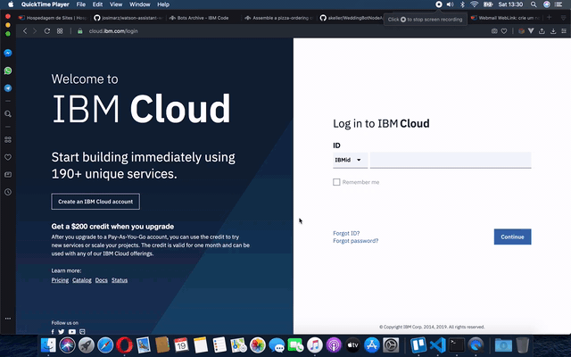
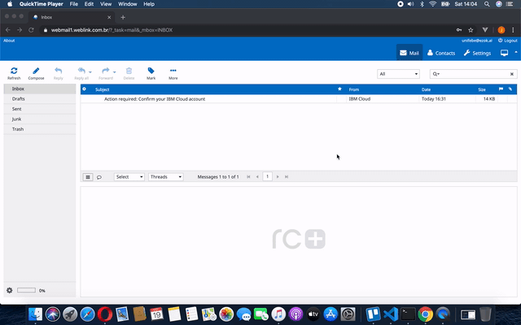
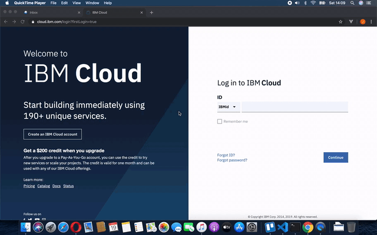

# Criando uma conta na IBM Cloud

Antes de começar, é necessário possuir uma conta na IBM Cloud. Acesse https://cloud.ibm.com/login e clique no botão **Create an IBM Cloud Account** para inciar o processo de criação da conta.

Preencha o formulário e confirme a criação da conta acionando o botão **Create Account**.

Será enviada uma mensagem de e-mail com as instruções para concluir a criação da sua conta na IBM Cloud.

Agora que já temos uma conta na IBM Cloud, vamos efetuar autenticação na plataforma para explorar os seus recursos.

## Provisionando um serviço na IBM Cloud

Atualmente, a IBM Cloud oferece aproxidamente 200 diferentes serviços na nuvem. Esses serviços incluem API's de Inteligência Artificial, bancos de dados, armazenamento, IoT, ferramentas para desenvolvimento e outros.

Nesse *workshop* nós vamos provisionar o serviço **Watson Assistant**, uma API para Processamento de Liguagem Natural ou *Natural Language Processing*(NLP).

Para provisionar esse serviço, a partir do *Dashboard* da IBM Cloud use o botão **Create Resource**.

Você será direcionado para o catálogo de recursos da IBM Cloud. No menu à esquerda, selecione a categoria **AI** para visualizar os serviços de inteligência artificial. Depois, selecione a opção **Watson Assistant**.

Na página seguinte, selecione a região do globo onde o seu serviço será hospedado. Prefira sempre as opções **Dallas** e **Washington DC**.

Logo abaixo da região são apresentados os planos. Mantenha seleciona o plano **Lite**. Esse plano é gratuíto e nos permite realizar até 10000 chamadas API por mês. Observe que os planos do tipo **Lite** são excluídos automaticamente após 30 dias de inatividade.

No final da página, no campo **Service name** informe o nome do serviço conforme desejar.

Para finalizar, clique no botão **Create**, localizado à direita, para confirmar o provisionamento do serviço.

[Explorando o Watson Assistant](Watson\ Assistant)