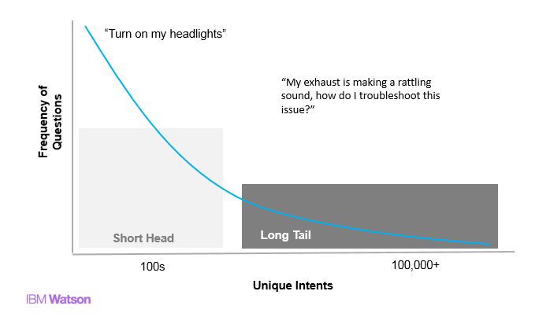
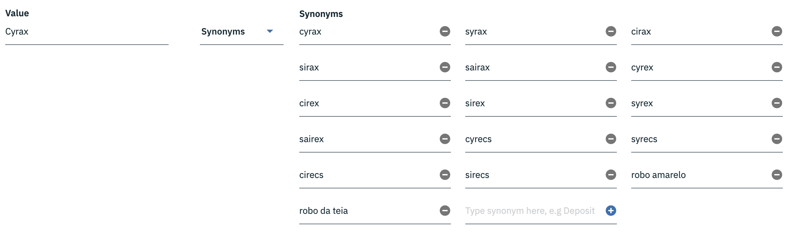
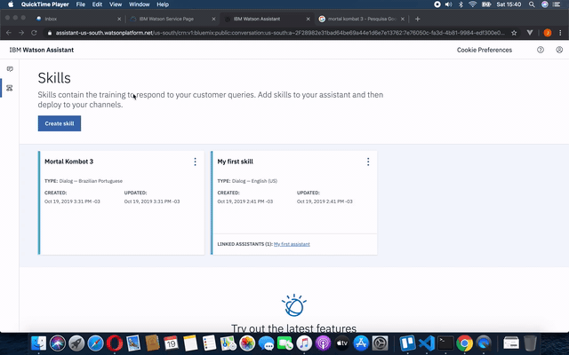
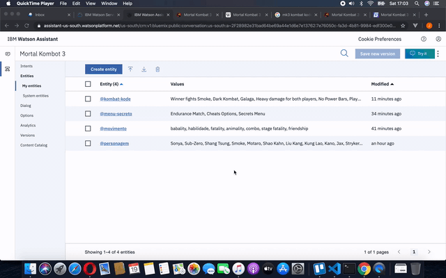

# Criando um chatbot

Depois de provisionar o serviço **Watson Assistant** estamos prontos para criar o nosso primeiro *chatbot*. Clique no botão **Launch Watson Assistant*

Você será direcionado para uma nova página. Note que à esquerda dessa página temos dois ícones. O primeiro ícone é intitulado *Assistants* e o segundo ícone é intitulado *Skills*.

*Assistants* são os canais de comunicação que você irá oferecer para os seus usuários conversarem com o seu *chatbot*, ao passo que a *skill* é o cérebro do *chatbot*.

Vamos começar criando uma nova *skill*.

* Clique na opção *Skills*.
* Acione o botão **Create Skill**.
* Selecione a opção **Dialog Skill** e **Next**.

Você pode criar uma nova *skill* do zero (*Create skill*), usar uma *skill* modelo (*Use sample skill*) ou importar uma *skill* já existente.

Vamos criar uma *skill* nova. Portanto, selecione a opção *Create skill*. Dê um nome para a sua *skill*, uma descrição e selecione o idioma desejado.

Para finalizar, clique em **Create dialog skill**.

Tá com preguiça de criar uma *skill* nova? Entre [aqui](https://developer.ibm.com/code/exchanges/bots/) e encontre um *bot* pronto para usar. 😪

Uma *skill* é seperada em três importantes seções:

* *Intents*: Aqui estão as intenções que o *bot* será capaz de interpretar.
* *Entities*: São as entidades da *skill*. Entidades são análogas a substantivos da língua portuguesa.
* *Dialog*: Árvore de diálogo do *bot*. Aqui nós definimos as respostas e decisões do *bot* de acordo com a entrada do usuário.

## Projetando um *chatbot*

Quando projetamos um *chatbot* temos que considerar algumas premissas:

1. Um *chatbot* é capaz de responder a um conjunto predeterminado de temas e questões.
2. Um *chatbot* deve ser projetado para responder questões simples e triviais, reduzindo a carga de trabalho do ser-humano.
3. Um *chatbot* sempre pode melhorar, mas deve sempre se manter dentro do domínio de negócio da sua proposta inicial.
4. Um *chatbot* deve estar preparado para dar vazão às questões não respondidas, encaminhando-as para um ser-humano.
5. O usuário deve saber que está falando com um *chabot* para evitar frustrações.

Um *chatbot* eficiente é aquele que consegue, com alto percentual de assertividade, responder um conjunto de questões recorrentes e de baixa complexidade. Esse conjunto de questões também é conhecido como cauda curta.

Tendo em mente as premissas acima citadas, vamos criar um *chatbot* para ajudar jogadores de Mortal Kombat 3 a obter informações sobre o jogo. Primeiro, vamos listar quais as informações mais comuns que os jogadores poderão solicitar:

* Personagens do jogo.
* Como executar combos.
* Como executar golpes especiais.
* Como executar *fatalities*.
* Como executar *animalities*.
* Como executar *babalities*.
* Como executar *friendships*.
* Como habilitar personagens secretos.
* Como habilitar menus secretos.
* Histórias dos personagens.
* Lista de *Kombat Kodes*.

### Identificando entidades

Agora que sabemos com clareza sobre os temas e questões que nosso *chatbot* será capaz de responder sobre, podemos iniciar o exercício de identificação das entidades.

Podemos comparar as entidades com os substantivos da língua portuguesa. Portanto, vamos criar as seguintes entidades:

* **Personagem**: Todos os personagens do jogo.
* **Movimento**: Tipos de movimento, que podem ser combos, especiais, *fatalities*, *animalities*, *babalities* ou *friendships*.
* **Menus secretos**: Os tipos de menu secreto do jogo.

Vamos criar nossa primeira entidade. Entre na sua *skill* e selecione a opção **Entities**. Clique em **Create entity** para criar uma nova entidade. Informe o nome da entidade como `personagem` e pressione **Create entity** para confirmar.

Agora, vamos criar os valores da nossa entidade. Cada personagem será um valor da entidade. Por exemplo, no campo valor informe `Cyrax` e depois selecione a opção *Synonyms* para indicar que este é um valor do tipo sinônimo.

No campo **synonyms** informe todos os sinônimos da palavra `Cyrax`, isto é, as diferentes formas que as pessoas usarão para se referir ao personagem Cyrax.

### Definindo as intenções

Intenções determinam um objetivo que o usuário deseja alcançar. Nas interações com *chatbots*, as intenções mais corriqueiras são:

* Obter uma informação.
* Solicitar ajuda.
* Fazer uma reclamação.
* Registrar uma sugestão.

O nosso *chatbot* para jogadores de Mortal Kombat 3 será capaz de fornecer as seguintes informações:

* Quais são os personagens do jogo.
* Quais são os personagens secretos.
* Como executar o movimento de um determinado personagem.
* Como habilitar um menu secreto.
* Como habilitar um personagem secreto.
* Como habilitar um *Kombat Kode*.

Vamos criar nossa primeira intenção. Dentro da nossa *Dialog skill*, selecionamos a opção *Intents*. Na sequência, clique no botão **Create intent** para abrir o formulário de inclusão da inteção.

No campo **Intent name** dê um nome da intenção e acione o botão **Create intent** para confirmar a criação da intenção.

Um novo campo denominado **User example** será habilitado. Nesse campo deve-se colocar exemplos das diferentes formas que os usuários utilizarão para perguntar sobre os personagens do jogo. Insira um exemplo e pressione `ENTER` para confirmar. Quanto mais exemplos, melhor!

