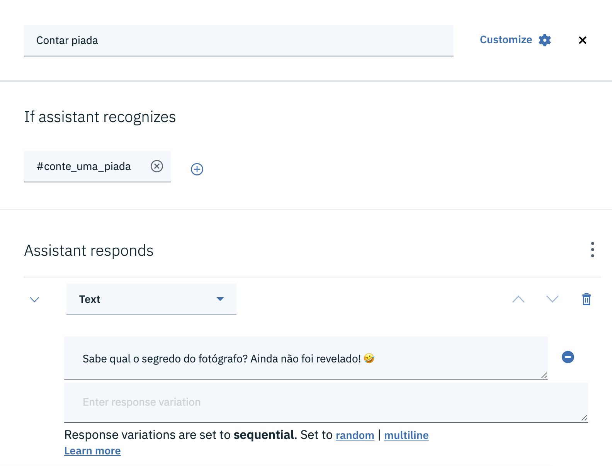
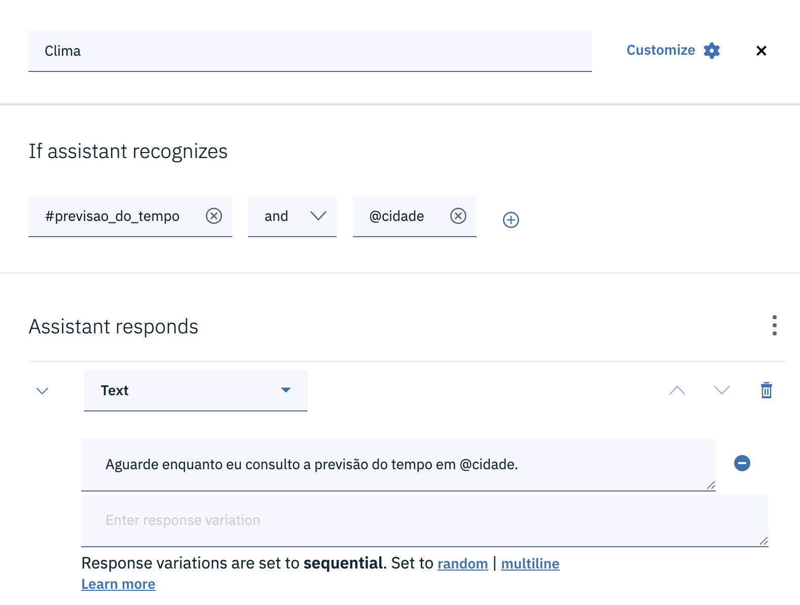
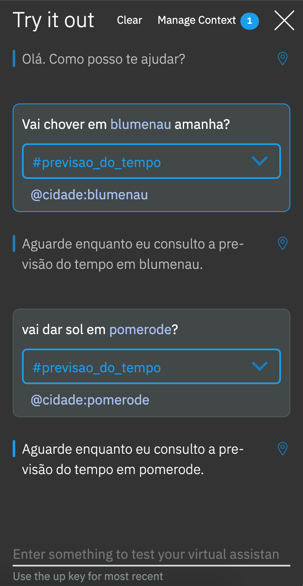
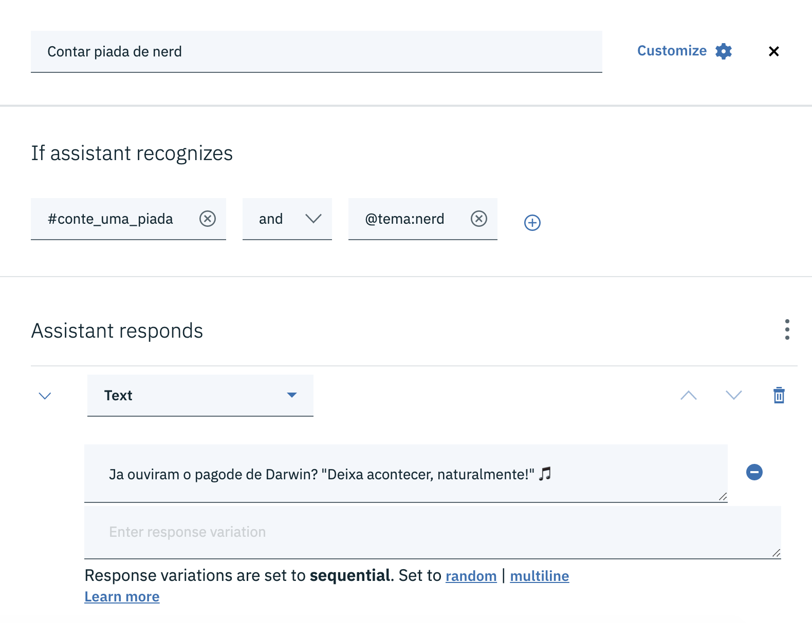
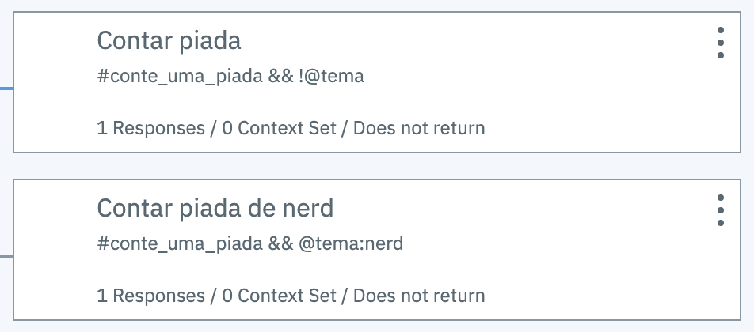
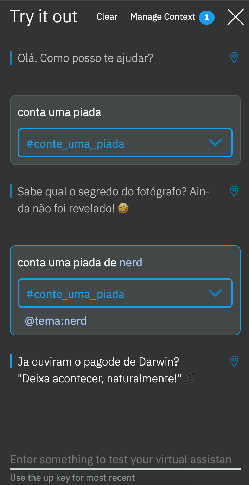

# Condição

O Watson Assistant executa um nó quando todas a condição desse nó é verdadeira. A condição do nó é definida na seção *If assistant recognizes*. Uma condição é um conjunto de expressões conectadas pelos operadores lógicos `and` e `or`.

Uma expressão pode verificar, por exemplo, se uma intenção foi reconhecida pelo assistente.

Uma expressão também pode verificar se o assistente reconheceu uma entidade, independente do valor reconhecido para essa entidade.

No exemplo a seguir, o assistente reconhece a intenção `previsao_do_tempo` e a entidade `cidade`.

Observe os resultados no teste.

Também podemos verificar um valor específico de uma entidade, como no próximo exemplo.

No próximo exemplo temos dois nós. O primeiro reconhece a intenção do usuário ouvir uma piada, mas sem um tema definido. No segundo nó o assistente identifica que o usuário deseja ouvir uma piada de *nerd*.

No primeiro nó o assistente está negando a existência da entidade `tema` usando o operador de negação `!`(ponto de exclamação): `!@tema`.

Eis o resultado do trabalho:

As possibilidades de combinações para montar condições são infinitas e, portanto, não será possível cobrir todas elas neste tutorial.

Você poderá encontrar mais informações na documentação oficial da IBM [neste](https://cloud.ibm.com/docs/services/assistant?topic=assistant-dialog-build) endereço.

[Voltar](..)