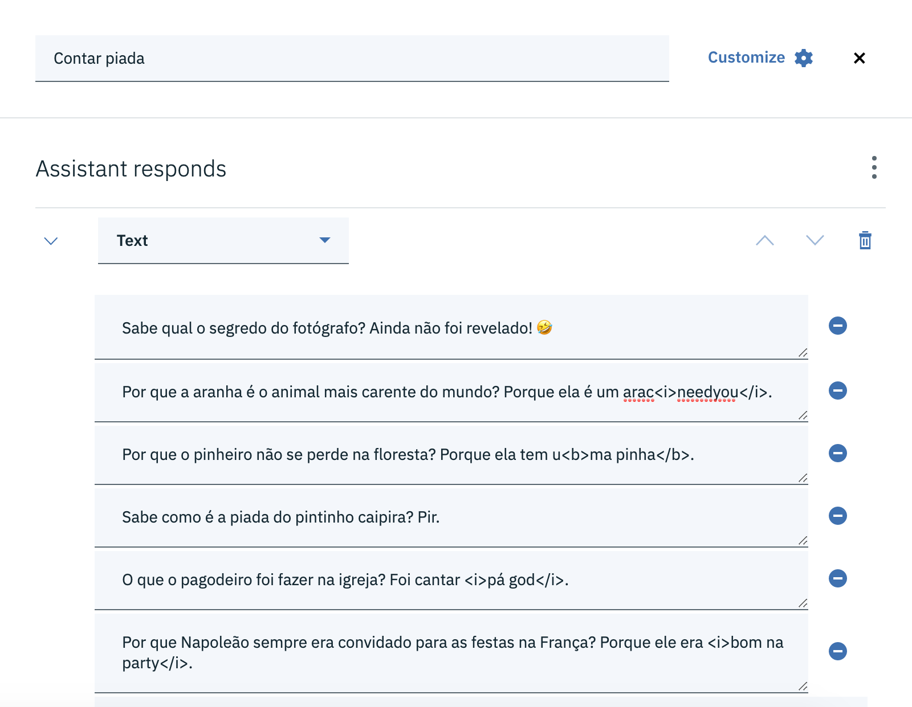

# Respostas do Assistente

A resposta do assistente é definida na seção *Assistant responds*. O assistente pode responder de quatro formas diferentes:

* *Text*: Texto.
* *Option*: Exibe um conjunto de opções.
* *Pause*: Executa uma pausa.
* *Image*: Exibe uma imagem.

## Respostas de texto

As respostas de texto possuem três diferentes variações:

* *Sequential*: Seleciona a próxima linha na sequência de respostas.
* *Random*: Seleciona uma linha de resposta aleatoriamente.
* *Multiline*: Exibe todas as linhas de resposta.

Para compreender a diferença entre os tipos, considere as seguintes respostas adicionadas em um nó:

No primeiro teste vamos configurar a variação de resposta com a opção *sequential*. Observe o resultado:

No próximo teste, configuramos a variação de respostas com o tipo *random*. Eis o resultado:

Com a opção de variação *multiline* habilitada, todas as linhas de resposta serão exibidas:

As respostas de texto também permitem a utilização código HTML para marcação de texto. Portanto, você pode utilizar esse recurso para destacar um texto em negrito, itálico, sublinhado ou até mesmo apresentar dados tabulados.

## Resposta com opções

O Watson Assistant pode responder com opções. As opções são exibidas como *links* que quando clicados enviam uma requisição para o assistente processar.

Quando o nosso assistente não entender o que o usuário deseja, por exemplo, podemos exibir uma lista de opções disponíveis.

Na seção *Assistant responds* selecione a opção *Option*. Logo abaixo serão exibidos dois campos: **Title** e **Description**. Abaixo desses campos devem ser definidas as opções. Cada opção é composta por um *list label* e um *value*. *List label* é a descrição que será exibida para o usuário, ao passo que *value* é o valor que será enviado para o assistente quando o usuário selecionar essa opção.

## Resposta com pausa

Esse tipo de resposta permite definir uma pausa durante a conversação. A pausa pode variar de 1 até 10000 milissegundos (10 segundos). Também é possível ligar a opção *Typing indicator*, que exibe para o usuário um indicador para informar que o assistente está digitando.

Essa opção não tem efeito na área de testes do Watson Assistant.

## Resposta com imagem

Essa opção permite exibir uma imagem para o usuário através da conversação.

Na seção *Assistant responds* selecione a opção *Image*. Preencha os campos **Title** e **Description** se desejar, eles são opcionais. No campo **Image source** informe a URL da imagem.

## Combinando tipos de respostas

Um nó pode conter dois ou mais tipos de respostas diferentes. Você pode, por exemplo, apresentar uma imagem e logo na sequência uma resposta de texto.

Para adicionar um novo tipo de resposta na seção *Assistant responds* acione a opção **Add response type**.

[Voltar](..)