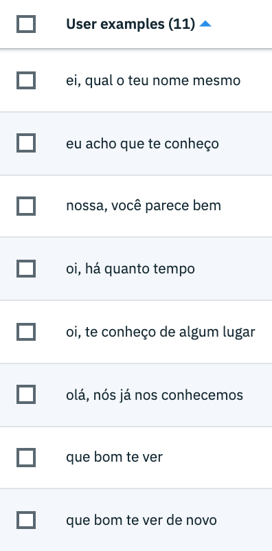
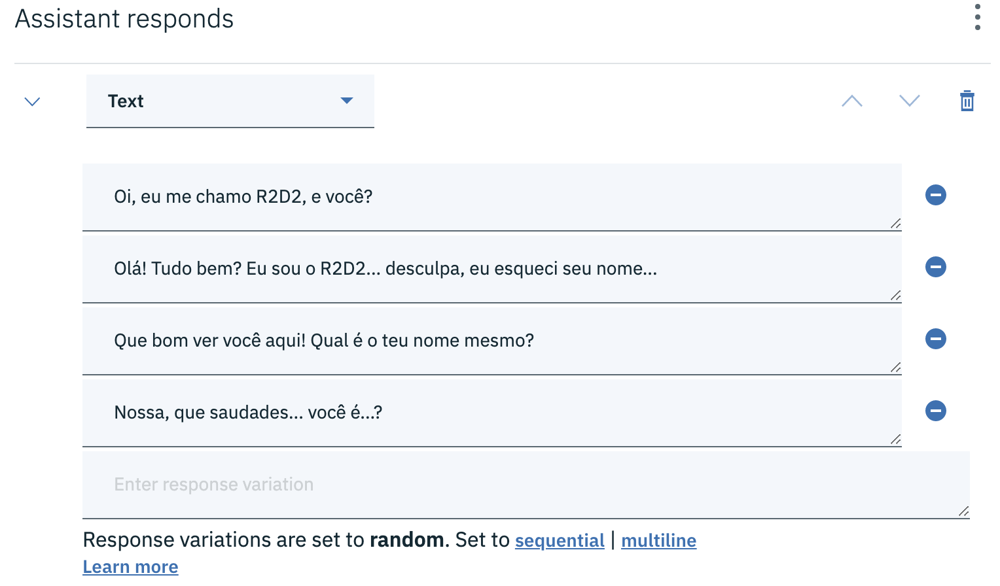
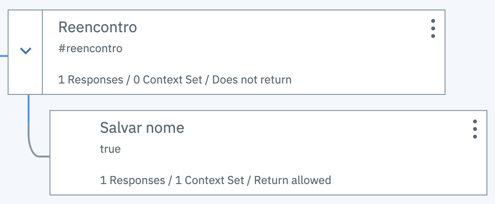
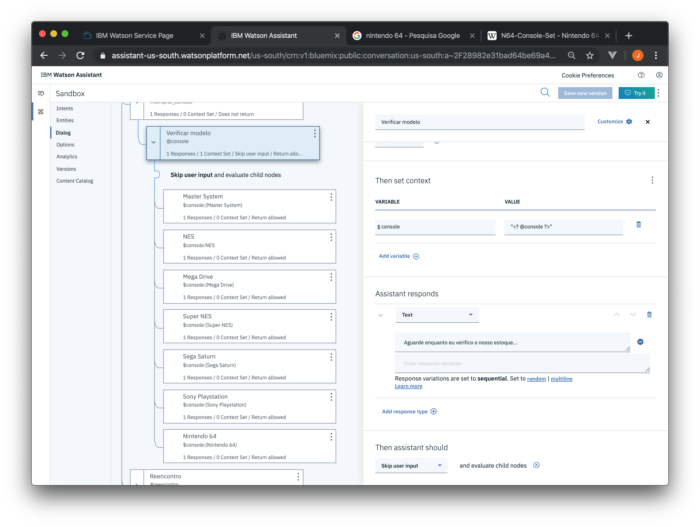

# Ações

Todo nó de um diálogo possui uma ação subsequente, isto é, uma ação que será executada após o assistente enviar a resposta para o usuário. Essa ação é definida na seção *Then assistant should*. São três opções disponíveis:

* *Wait for user input*: Aguarda entrada do usuário.
* *Skip user input*: Não aguarda entrada do usuário.
* *Jump to*: Pula para outro nó.

## *Wait for user input*

Esta é a ação padrão de todo nó de diálogo do Watson Assistant. Isso significa que após emitir uma resposta, o assistente irá aguardar uma nova entrada do usuário para avaliar o próximo nó de diálogo na sequência.

No exempo acima, temos um nó que reconhece expressões que denotam um reencontro. Essas expressões definidas em uma intenção denominada `reencontro`.

O assistente responde de forma aleatória com uma das seguintes respostas.

Depois de responder, o assistente aguarda uma entrada do usuário (*Wait for user input*), isto é, aguarda que o usuário informe seu nome. para então executar o nó filho.

## *Skip user input*

Este tipo de configuração deve ser usado quando desejamos avançar para o próximo nó de diálogo sem aguardar entrada do usuário.

Observe no exemplo acima que no nó denominado `Comprar video game console` o assistente reconhece o desejo do usuário de comprar um console de vídeo game.

No nó seguinte, o assistente pergunta qual o modelo e aguarda uma resposta do usuário. Depois que o usuário informa o modelo o assistente responde "Aguarde enquanto eu verifico o nosso estoque...". Na seção *Then assistant should* esse nó está configurado como *Skip user input*. Isso significa que o assistente não aguardará uma entrada do usuário e executará a avaliação de todos os nós subsequentes.

## *Jump to*

Esta opção permite o assistente saltar entre nodos de diálogo.

Considere o exemplo anterior. Imagine que após o assistente perguntar para o usuário qual modelo de console ele deseja comprar o usuário escreva algo como "Me conte uma piada". Nós podemos fazer o nosso assistente pular para o nó de piadas.

Quando usamos a opção *Jump to* devemos escolher qual será o comportamento do assistente ao avaliar o nó de destino. Existem três diferentes comportamentos:

* *Wait for user input*: Aguarda uma entrada do usuário antes de concluir a ação, isto é, pular para o nó de destino.
* *If assistant recognizes (condition)*: Pula para o nó de destino somente se a condição desse nó for satisfeita.
* *Respond*: Pula para o nó de destino e executa a resposta desse nó, independente das condições.

[Voltar](..)