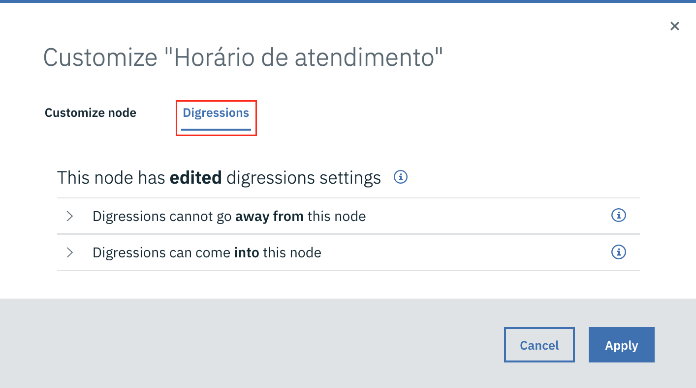

# Digressão

Provavelmente você já percebeu que o Watson Assistant processa os nodos de diálogo de forma sequencial. Também deve ter pecebido que, quando o assistente entra em um determinado nó que possui nodos filhos, apenas os nodos filhos serão processados, a menos que usemos a ação **Jump to**, para forçar a saída de um fluxo.

Agora, vamos considerar outra situação. Você deve se lembrar do exemplo da pizzaria que usamos para ilustrar o uso dos *slots*. Imagine que durante o processo de pedido da pizza, o usuário questione sobre o horário de atendimento da pizzaria, como no exemplo de diálogo abaixo:

> **Usuário**: Quero pedir uma pizza

> **Assistente**: Qual sabor?

> **Usuário**: Pepperoni

> **Assistente**: Qual bebida?

> **Usuário**: Até que horas vocês atendem?

Nesse momento, o assistente deve pular para um nó que mostra o horário de atendimento da pizzaria, mas não deve sair do fluxo do pedido para não perder as informações que já foram coletadas.

Para fazer esse tipo de comportamento vamos usar a digressão. Primeiro precisamos habilitar a opção para permitir que digressões saiam do nó responsável por realizar a captura dos pedidos.

* Selecione o nó e clique no botão **Customize**.

  
* Na janela de customização, selecione a aba **Digressions**.

  
* Abra a seção **Digressions can (cannot) go away from this node**, habilite a opção **Allow digressions away while slot filling** e clique em **Apply** para conluir.

  

Depois, precisamos habilitar a digressão também no nó de destino, para indicar que após processar esse nó ele dever retornar para o fluxo original.

* Primeiro selecione o nó de destino e clique em **Customize**.

  
* Na janela de customização, selecione a aba **Digressions**.

  
* Selecione a opção **Digressions can (cannot) come into this node** e habilite a opção **Allow digressions into this node**. Marque a opção **Return after digression** e clique em **Apply** para concluir.

  

Agora vamos testar o resultado.

[Voltar](../)