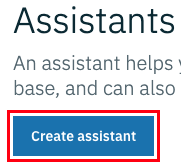
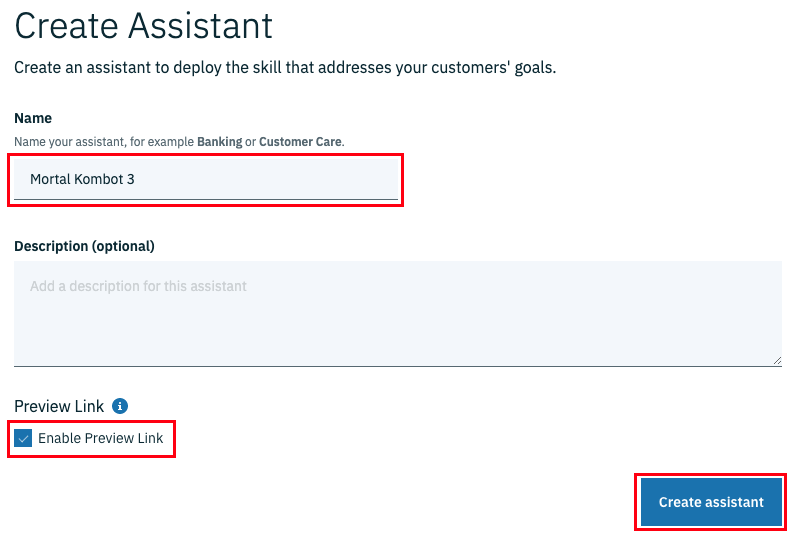
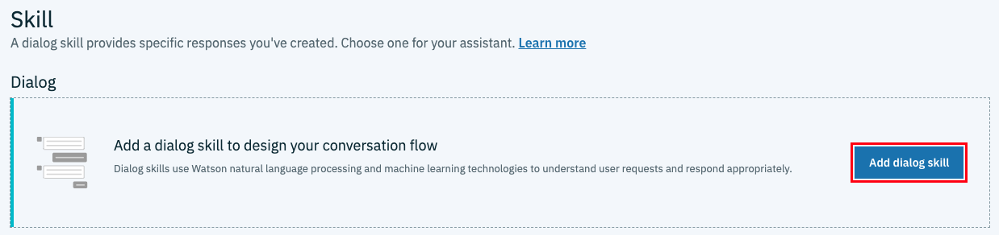
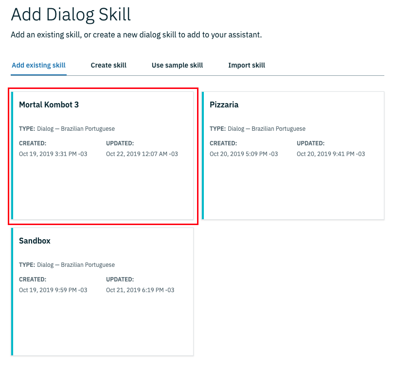
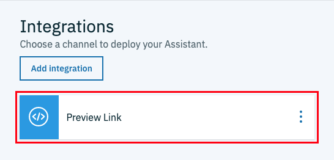
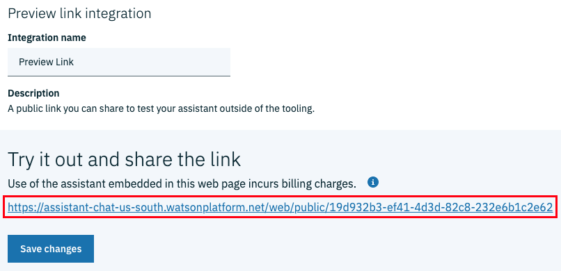
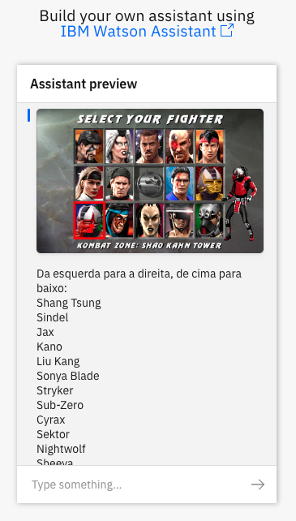

# Integrações

Até o momento nós apenas treinamos o nosso assistente virtual. A partir desse momento nós vamos disponibilizar um canal de comunicação com o nosso assistente. Atualmente, a IBM fornece integração com cinco canais de comunicação nativos e uma sexta opção ainda em versão *beta*.

* [Facebook Messenger](facebook)
* [Slack](slack)
* Intercom
* [Voice Agent](voice-agent)
* [Telegram](telegram)
* WordPress plug-in

Antes de criar uma nova integração, precisamos primeiro criar um novo assistente.

* Na plataforma IBM Watson Assistente, selecione a opção **Assistants** no menu lateral.

  
* Clique em **Create assistant** para criar um novo assistente.

  
* Preencha o formulário, mantenha a opção **Enable Preview Link** habilitada e clique em **Create assistant**.

  
* Você será direcionado para a tela de configuração do assistente; clique em **Add dialog skill** para selecionar o cérebro do assistente.

  
* Selecione a *skill* desejada para concluir.

  

Observe que após concluir a criação do assistente, podemos visualizar à direita as integração habilitadas. Como habilitamos a opção **Enable Preview Link** na criação do assistente, o Watson Assistente criou automaticamente uma integração de testes. Clique em **Preview Link** para testar o assistente virtual.

Depois de clicar na integração **Preview link** você será direcionado para uma página com os detalhes da integração, incluindo um endereço de testes.

Clique no link para realizar testes no seu novo assistente virtual.

[Voltar](../)