# Facebook

O IBM Watson Assistant fornece integração nativa com o **Facebook Messenger**.

Para habilitar a integração com o **Facebook Messenger**:

* Na plataforma IBM Watson Assistant, selecione a opção **Assistants**.

  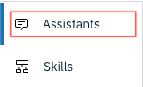
* Selecione o assistante para o qual você deseja habilitar integração com o **Facebook Messenger**.

  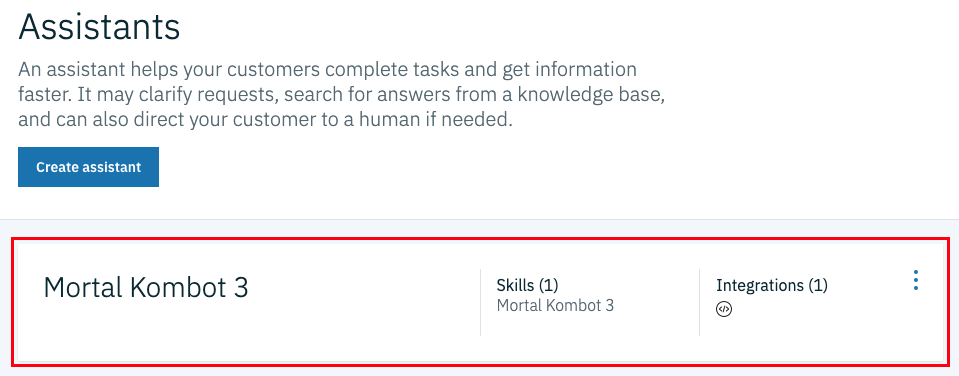
* Na lista de integrações, acione o botão **Add integration**.

  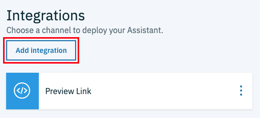
* Na etapa seguinte, selecione a opção **Facebook Messenger**.

  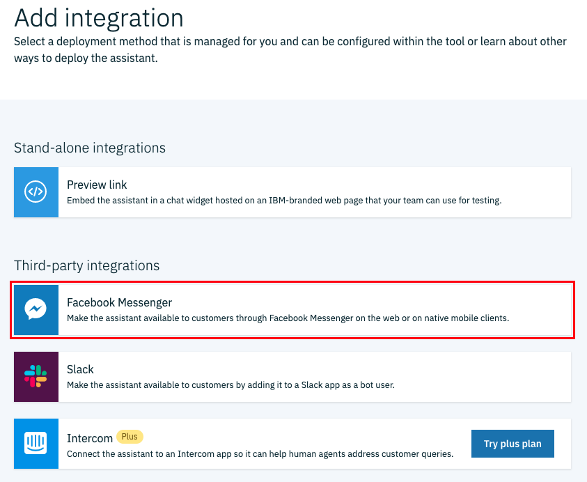

Depois, siga todas as instruções da página para concluir a integração.

## Etapa 1

**Criar um aplicativo do Facebook**

Primeiro precisamos criar uma nova aplicação no Facebook. Certifique-se de que você já está autenticado no Facebook, depois ingresse na página de desenvolvedores do Facebook através [deste](http://developers.facebook.com/) endereço.

Acione o menu **Meus aplicativos** e então a opção **Criar aplicativo**.

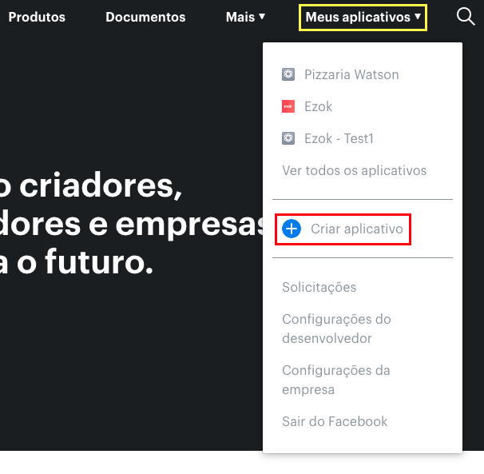

Uma nova janela será apresentada. Forneça um nome para o aplicativo, um e-mail para contato e clique em **Criar identificação de aplicativo** para concluir.

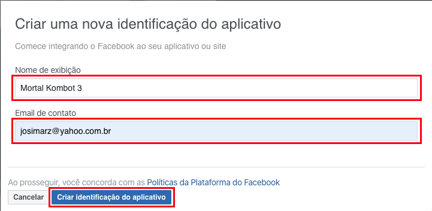

Após concluir a criação do aplicativo você será direcionado para o painel de configuração. Agora, precisamos copiar a **Chave secreta do aplicativo**:

* No menu de navegação, selecione **Configuração** > **Básico**
* No formulário, dentro do campo **Chave Secreta do Aplicativo**, acione o botão **Mostrar**
* Copie a chave do aplicativo.

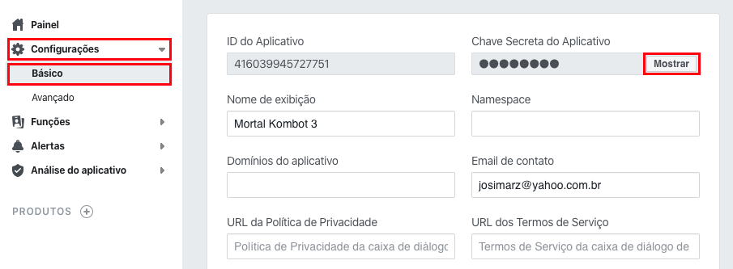

Retorne à plataforma IBM Watson Assistant, na página de configuração da integração com o Facebook Messenger, e cole a chave do aplicativo no campo **Application secret**.

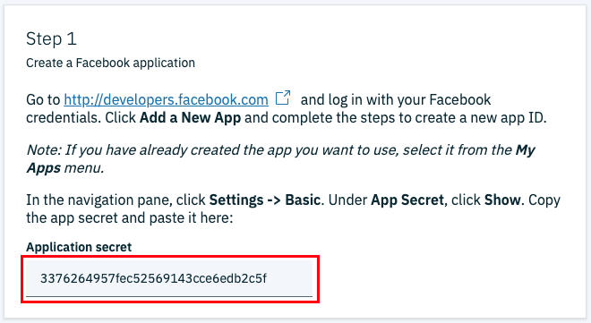

## Etapa 2

**Conectar o Watson Assistant com o Facebook**

Antes de começar esta etapa, certifique de que você já possui uma página do Facebook criada. Se você ainda não tem uma página, siga os passos:

* Na barra de ferramentas do Facebook, clique em **Criar** e selecione a opção **Página**

  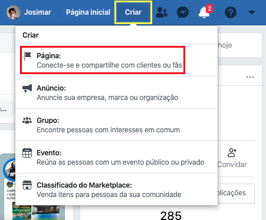
* Na etapa seguinte, selecione o tipo de página desejado, que pode ser **Negócio ou marca** ou **Comunidade ou figura pública**

  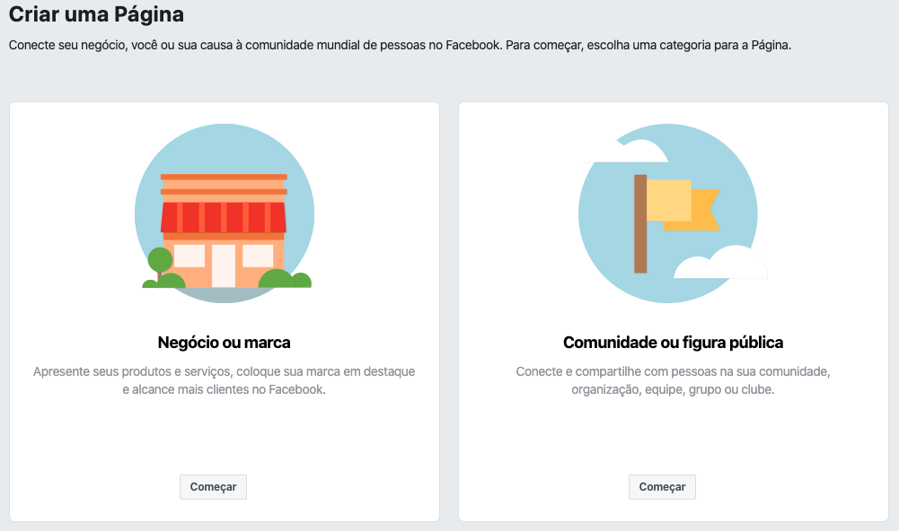
* Preencha o formulário de criação da página e clique em **Continuar** para prosseguir

  
* Se desejar, você pode adicionar uma foto de perfil à nova página

  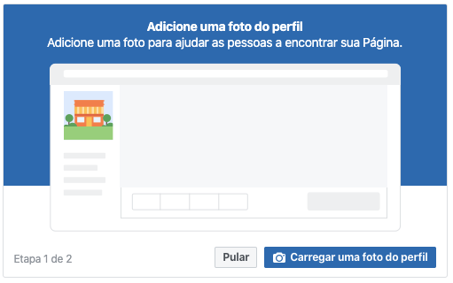

Agora que temos nossa página criada, podemos executar os próximos passos.

* No painel do aplicativo no Facebook, clique no sinal **+** ao lado da opção **Produtos** localizado no menu de navegação

  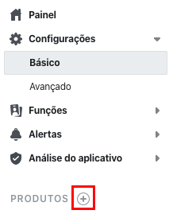
* Localize o produto **Messenger** e clique no botão **Configurar**

  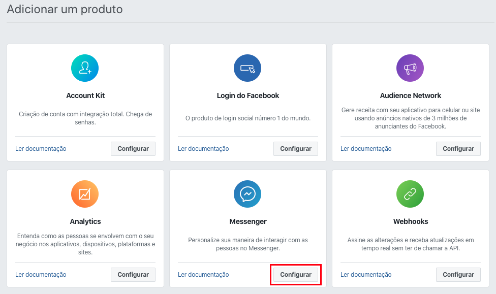
* Na página de configuração do **Messenger**, na seção **Tokens de acesso**, clique em **Adicionar ou remover Páginas**

  
* O Facebook irá solicitar sua autorização para dar sequência ao processo de integração da página com o aplicativo

  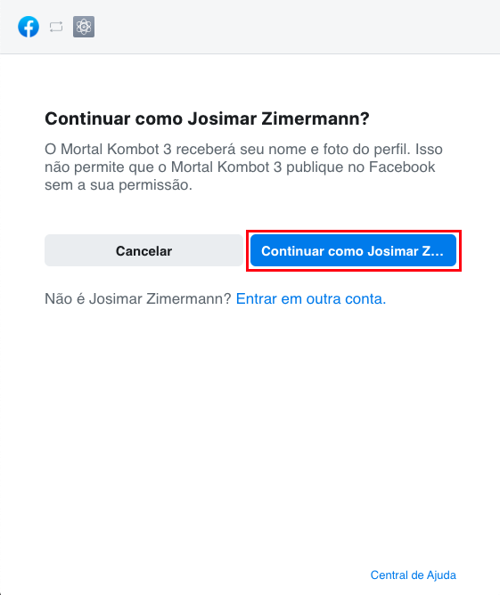
* Na sequência, selecione a página que será usada para responder os usuários automaticamente usando o Watson Assistant e clique em **Avançar**

  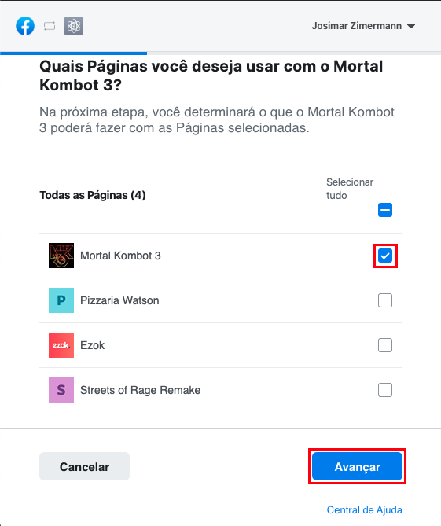
* Mantenha a opção **Gerencie e acesse as conversas da Página no Messenger** e clique em **Concluir** para finalizar

  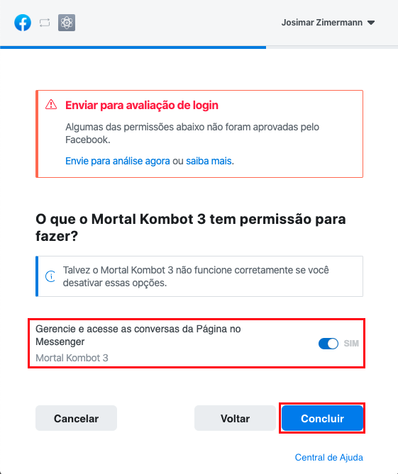
* Se tudo correr bem, você verá uma mensagem como esta

  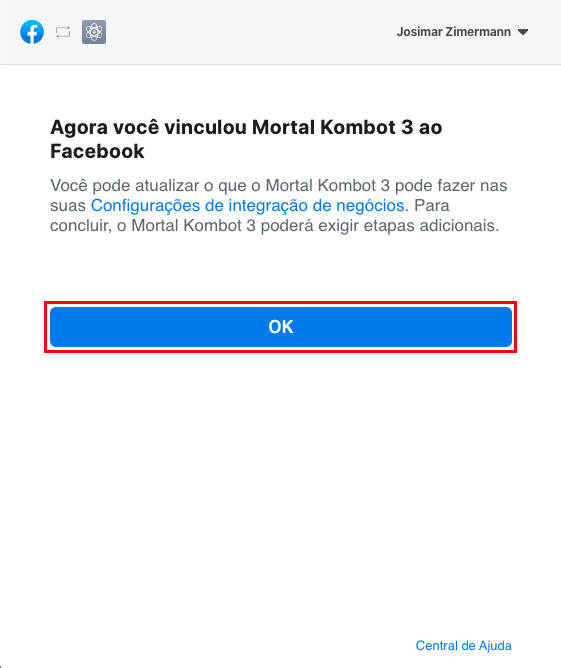

A página selecionada será apresentada dentro da seção **Tokens de acesso**. Clique no botão **Gerar token** para criar um novo token de acesso para a página adicionada.

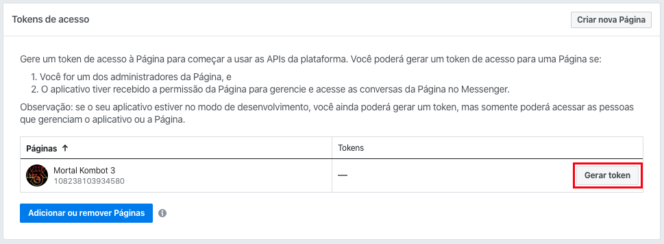

Será apresentada uma nova janela com algumas instrução sobre a geração do token. Marque a caixa **Entendi** e clique em **Copiar** para copiar o novo token gerado. Clique em **Concluir** para fechar a janela.

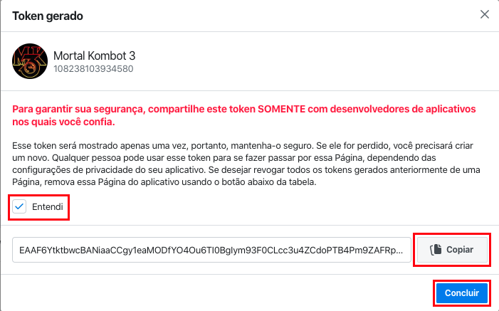

Retorne à plataforma IBM Watson Assistant e cole o token no campo **Page access token**.

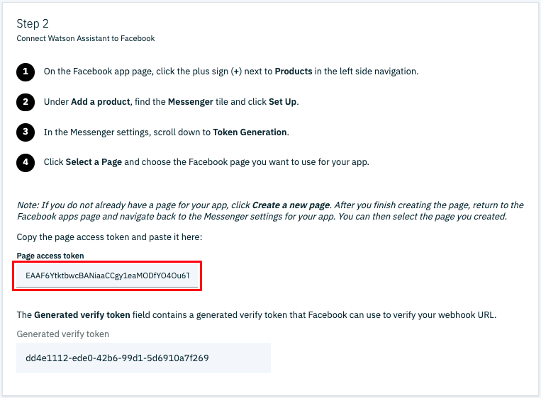

## Etapa 3

**Configurar *webhooks* do Facebook**

Nesta etapa vamos configurar as URL's de comunicação entre o **Facebook Messenger** e o IBM Watson Assistant.

Primeiro, na plataform IBM Watson Assistant, clique em **Generate callback URL**.

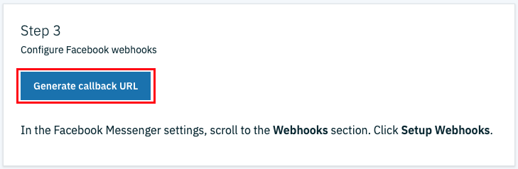

Depois de gerar a URL de *callback*, siga os passos.

* Na página de configuração do Facebook Messenger, na seção **Webhooks**, clique em **Adicionar URL de retorno**

  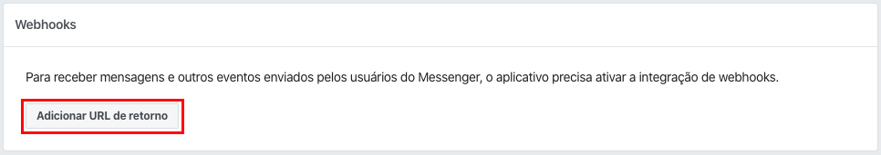
* No campo **URL de retorno de chamada** cole a URL gerada na plataforma IBM
* No campo **Verificar token** cole o **Generated verify token**, disponibilizado na seção **Step 2** do Watson Assistant
* Clique em **Verificar e salvar** para concluir

  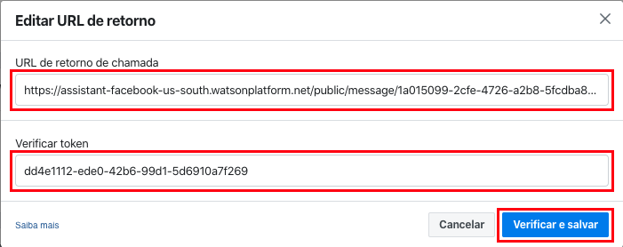
* Clique em **Adicionar assinaturas**, marque as opções **messages** e **messaging_postbacks**; clique em **Salvar** para concluir

  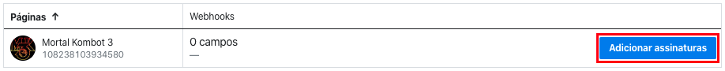
  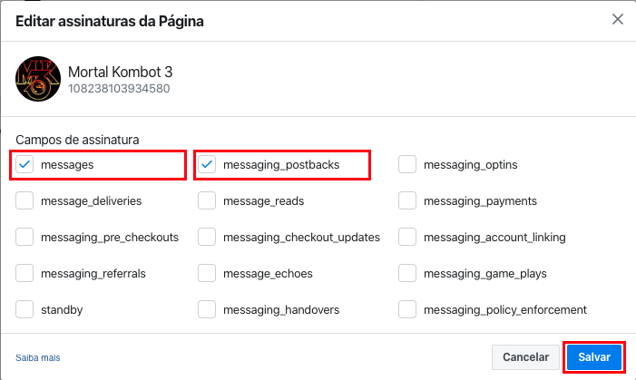

## Etapa 4

**Salvar e testar**

Retorne à plataforma IBM Watson Assistant. No rodapé da página clique em **Save changes** para concluir.

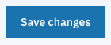

Agora, vamos testar o nosso assistente através do [Facebook Messenger](https://www.facebook.com/messages).

Primeiro, precisamos encontrar a nossa página.

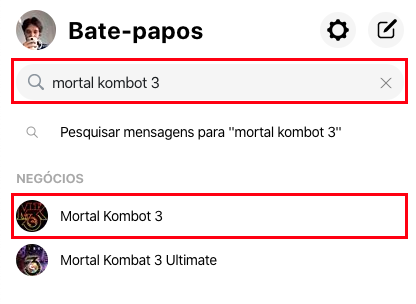

Agora, é só conversar com o assistente.

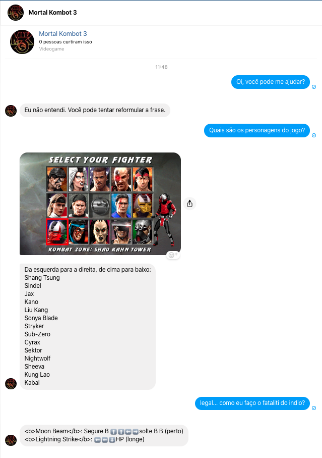

🙌🙌🙌

[Voltar](../)