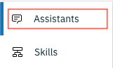
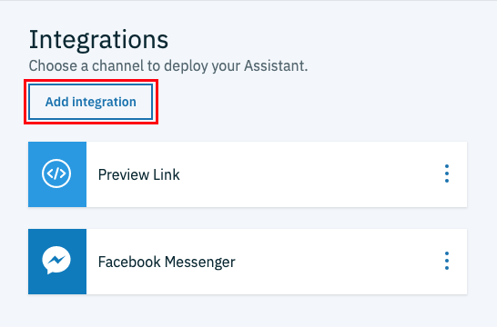
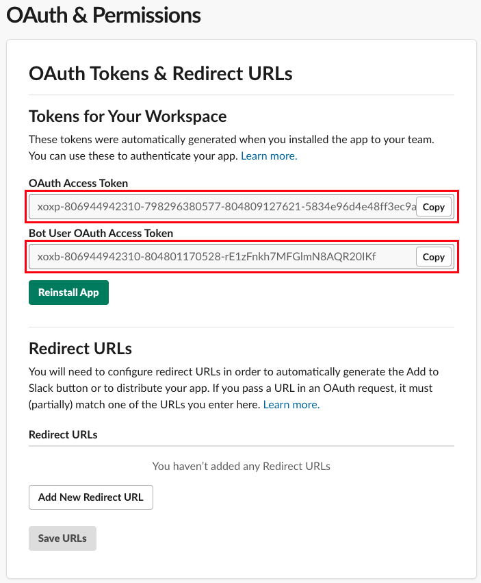
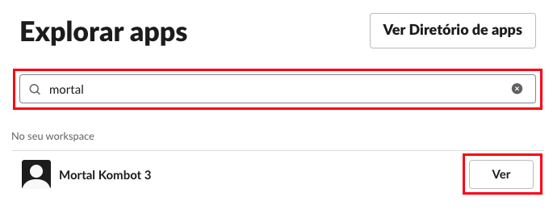

# Slack

O **Slack** é uma plataforma de comunicação proprietária, largamente utilizada para comunicação entre membros de grupos de trabalho e empresas.

## Criando conta no Slack

Antes de realizar a integração com o **Slack**, precisamos criar uma conta na plataforma. Primeiro, acesse [este](https://slack.com/intl/pt-br/) endereço.

* Insira seu endereço de e-mail no campo **Seu e-mail de trabalho** e clique em **TESTAR GRATUITAMENTE**

  
* Na etapa seguinte, selecione a opção **Criar um novo workspace**

  
* Um código de verificação será enviado para o seu e-mail. Use esse código para avançar na próxima etapa

  
* Após a verificação do código de segurança, informe o nome da sua empresa ou equipe e clique em **Próximo**

  
* Depois, insira o nome do projeto e clique em **Próximo** para avançar

  
* Na etapa seguinte, você pode adicionar novos membros à sua equipe. Por enquanto, vamos pular essa etapa

  
* Pronto! Para finalizar, clique no botão **Seu canal no Slack**

  

Você será automaticamente direcionado para a plataforma do Slack.

## Criando integração com o Slack

* Retornando à plataforma do IBM Watson Assistant, clique em **Assistants**

  
* Selecione o assitente desejado

  
* Na seção **Integrations**, clique no botão **Add integration**

  
* Selecione a opção **Slack**

  

Na próximo página, siga as instruções para concluir a integração com o Slack.

### Etapa 1

**Configure o seu aplicatvo Slack**

Acesse [este](https://api.slack.com/slack-apps) endereço para criar um aplicativo no Slack. Você será direcionado para uma página de introdução à criação de aplicativos para o Slack.

* Clique em **Your Apps**, no canto superior direito da página

  
* Clique em **Create New App** para criar um novo aplicativo

  
* Informe um nome para o seu aplicativo
* Selecione um *workspace*
* Clique em **Create App** para concluir

  

Você será direcionado à página de configuração do aplicativo. Acesse a opção de menu **Bot Users** e acione o botão **Add a Bot User**.

Preencha os campos **Display name**, **Default username**, habilite a opção **Always Show My Bot as Online** e clique em **Add Bot User** para confirmar a criação do *bot*.

### Etapa 2

**Conecte o Watson Assistant com o Slack**

Acesso a opção de menu **Basic Information** na página de configuração do aplicativo no Slack.

Na seção **App Credentials**, copie o conteúdo do campo **Verification Token**.

Retorna à página de configuração da integração no IBM Watson Assistente e cole o token no campo **Verification token**.

Voltando à página de configuração do aplicativo no Slack, acesse a opção de menu **OAuth & Permissions**. Acione o botão **Install App to Workspace**

O aplicativo irá solicitar permissão para acessar o seu *workspace*. Clique em **Permitir**.

Serão criados dois tokens; o **OAuth Access Token** e o **Bot User OAuth Access Token**.

Ambos os tokens devem ser inseridos nos campos homônimos na página de configuração da integração no IBM Watson Assistant, na seção **Step 2**.

### Etapa 3

**Configure o seu *bot* Slack**

Na seção **Step 3** da página de configuração da integração, acione o botão **Generate request URL**.

Depois, copie a URL gerada.

Novamente na página de configuração do aplicativo no Slack.

* Acesse a opção de menu **Event Subscriptions**

  
* Habilite os eventos

  
* No campo **Request URL** cole a URL de *callback* fornecida pelo Watson Assistant

  

### Etapa 4

**Conecte o seu assistente**

* Ainda na seção **Event Subscriptions** da página de configuração do aplicativo no Slack, abra a seção **Subscribe to Bot Events** e clique em **Add Bot User Event**

  
* Selecione os eventos **message.im** e **app_mention**

  
* No rodapé da página, clique em **Save Changes** para concluir

  
* Depois de salvar as alterações, você será notificado que é necessário reinstalar o aplicativo para que as novas configurações tenha efeito. Clique em **reinstall your app** para concluir a operação

  
* Conceda as permissões necessárias para avançar

  

Para finalizar, vamos adicionar ao nosso aplicativo o suporte para o uso de componentes interativos. Na página de configuração do aplicativo no Slack:

* Acesse a opção de menu **Interactive Components**

  
* Habilite a opção **Interactivity**

  
* No campo **Request URL**, cole a URL fornecida na seção **Step 3** da página de configuração da integração do Watson Assistant

  
* No rodapé da página, clique em **Save Changes** para concluir

  

Retorne à página de configuração da integração no Watson Assistant e clique em **Save changes** para concluir.

Pronto! É hora de testar o nosso *bot* no Slack.

* No menu lateral do Slack, na seção **Apps**, clique em **+Adicionar apps**

  
* Procure o seu aplicativo pelo nome e clique em **Ver**

  

Agora é só trocar umas palavras com o nosso *bot* e verificar o resultado.

[Voltar](../)