# Telegram

O Telegram é o aplicativo de mensagens mais utilizado quando o WhatsApp está fora do ar 😂.

## Criando um bot no Telegram

Para criar um *chatbot* no Telegram integrado com o Watson Assistant, vá no telegram e inicie uma conversa com o **BotFather**.

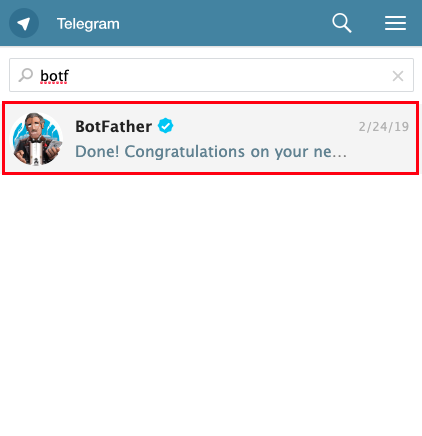

Envie o comando `/newbot` e siga as instruções:

* Informe o nome do *bot*.
* Informe o *username* do *bot*. Ele deve terminar com o termo `bot`.

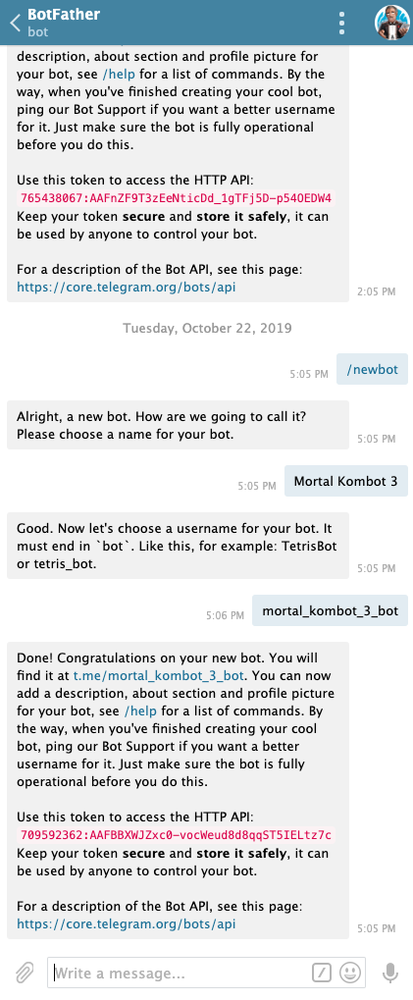

Você receberá uma token de acesso que será usado posteriormente na integração.

## Provisionando o Node-RED

O Node-RED é uma ferramente de desenvolvimento baseada em fluxo para programação visual, que roda sobre Node.js.

Para provisionar o serviço Node-RED, acesse o *dashboard* da IBM Cloud e acione o botão **Create resource**.

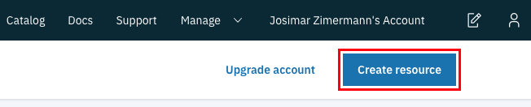

Você será direcionado para o catálogo de serviços. Na lista de categorias, selecione a opção **Starter Kits**. Depois, selecione o serviço **Node-RED Starter**.

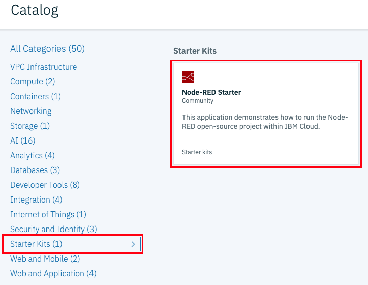

* No campo **Select a region**, selecione a região onde deseja provisionar o serviço

  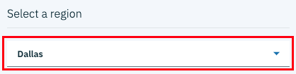
* Na seção **Select a pricing plan**, mantenha a opção **Lite** selecionada, tanto para **SDK for Node.js** como para **Cloudant**

  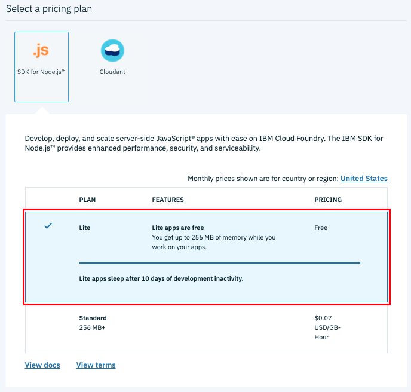
* Preencha o campo **App name** com o nome do seu aplicativo.
* No campo **Host name** defina o nome da URL do seu aplicativo.
* No campo **Domain** selecione um dos domínios disponíveis.

  
* Clique em **Create** para concluir

  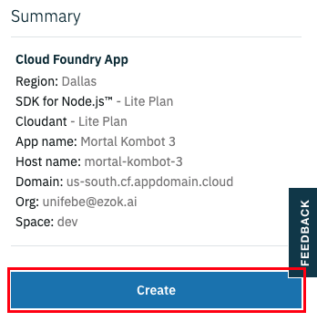

Pode levar alguns minutos até que a instância fique pronta para uso...😪

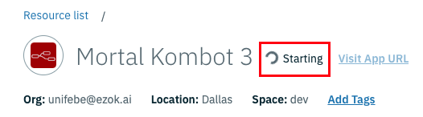

Assim que a instância estiver pronta para uso, ela irá mudar para o *status* ***This app is awake.***. Clique no *link* **Visit App URL** para iniciar o Node-RED.

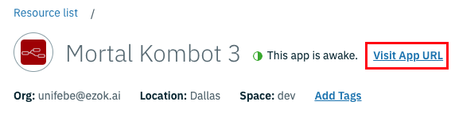

Você será guiado em alguns passos para realizar o seu primeiro *login* no Node-RED:

* Na tela de boas-vindas, apenas avance usando o botão **Next**

  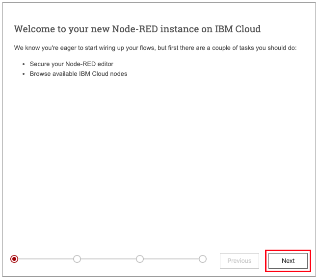
* Crie um nome de usuário e uma senha para acessar o Node-RED

  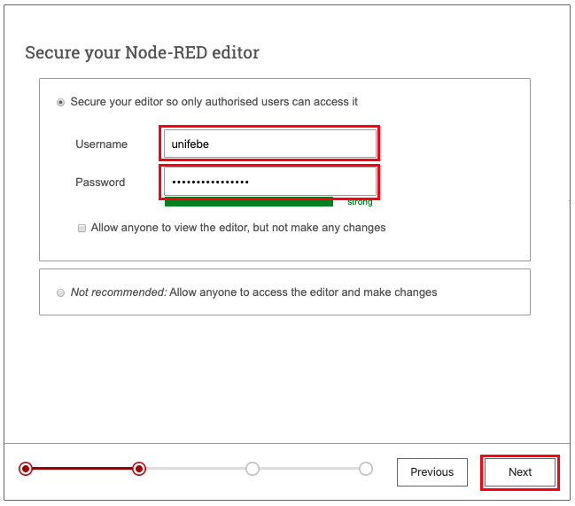
* Na etapa seguinte, serão exibidos os nodos que serão automaticamente instalados junto com a sua instância do Node-RED. Apenas avance com o botão **Next**

  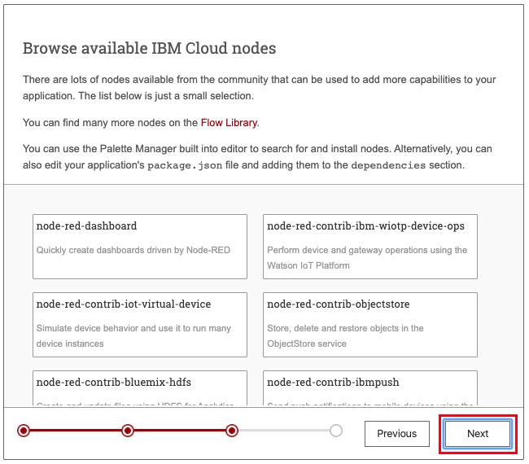
* Pronto! Clique em **Finish** para concluir

  

Aguarde alguns segundos até o Node-RED concluir as configurações. Você será direcionado para a página incial da sua instância do Node-RED. Clique em **Go to your Node-RED flow editor**.

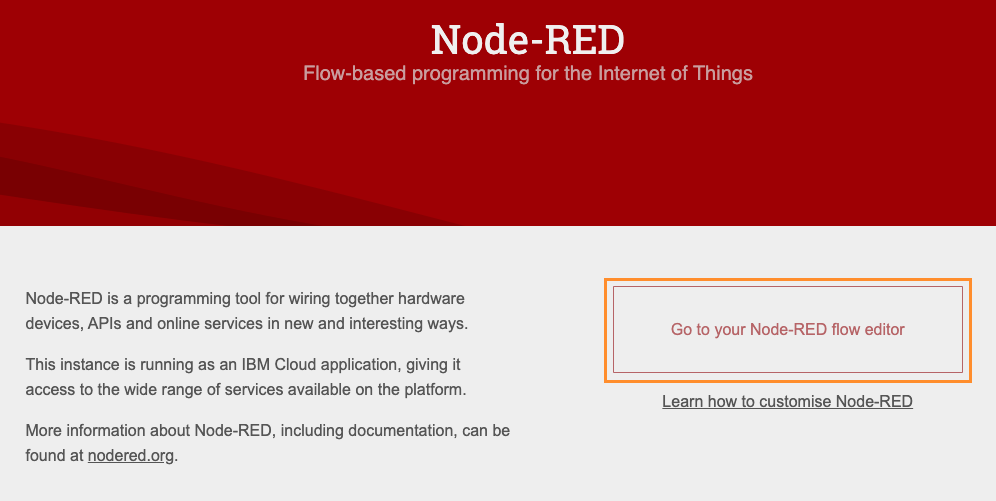

Será solicitado entrar com o usuário e senha que criamos anteriormente. Insira os seus dados e clique em **Login** para avançar.


Parabéns! Você está usando o Node-RED.

## Criando integração com o Telegram

Agora vamos programar a integração do Watson Assistant com o Telegram.

### Configurando a comunicação com o Telegram

Por padrão, o Node-RED criou uma aba denominada `Flow 1`. Vamos renomeá-la para `Telegram`:

* Dê um duplo clique sobre a aba para abrir o painel de propriedades.

  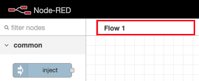
* No campo **Name** insira o novo nome para aba.
* Clique em **Done** para concluir.

  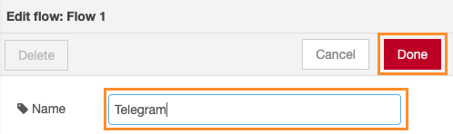

Agora, vamos instalar um pacote de nodos para comunicação com o Telegram:

* No canto superior direito, abra o menu de opções.
* No menu, selecione a opção **Manage palette**.

  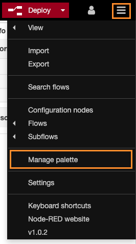
* Será apresentado um painel de nodos. Nesse painel selecione a aba **Install**.
* No campo **search modules**, procure por "telegram".
* Na lista de nodos, encontre o nó `node-red-contrib-telegrambot`.
* Clique em **install** para instalar esse nó.

  
* O Node-RED solicitará confirmação adicional. Clique em **Install** para concluir a instalação e aguarde.

  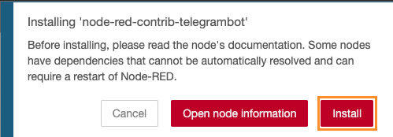

Depois de concluir a instalação dos nodos, vamos iniciar a programação. No painel de nodos, no campo **filter nodes**, insira o termo "telegram" para visualizar os nodos para integração com o Telegram.

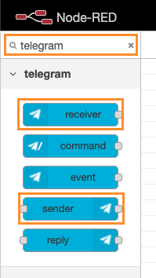

Selecione e arrastes os nodos **receiver** e **sender** para o editor.

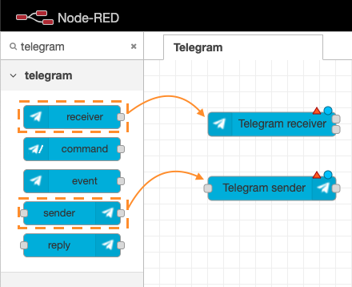

Agora vamos configurar o nó responsável por receber as mensagens enviadas para o nosso *bot* no Telegram:

* Dê um duplo clique sobre o nó **Telegram receiver**.

  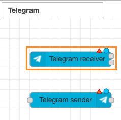
* No painel de propriedades do nó, à direita do campo **Add new telegram bot...**, clique no ícone do lápis.

  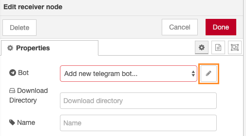
* Um novo painel de propriedades será apresentado.
  * **Bot-Name**: Insira o nome do *bot* criado no Telegram.
  * **Token**: Token fornecido pelo *BotFather*.
  * Clique em **Add** para concluir a inclusão do *bot*.

    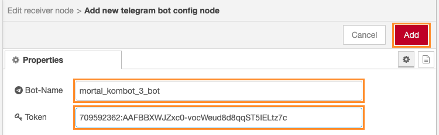
* Clique em **Done** para concluir.

  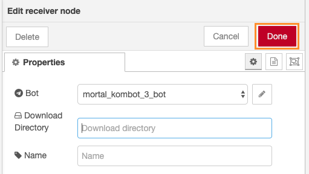

Agora vamos configurar o nó responsável por enviar as respostas para o nosso *bot* no Telegram:

* Dê um duplo clique sobre o nó **Telegram sender**.

  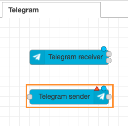
* No painel de propriedade do nó, no campo **Bot** selecione o seu *bot*.
* Clique em **Done** para concluir.

  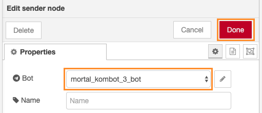
* Clique em **Deploy** para salvar as alterações.

  

### Configurando a conexão entre Node-RED e Watson Assistant

Antes de avançar, precisamos realizar algumas configuração no nosso serviço Watson Assistant para que ele possa se comunicar com a nossa instância do Node-RED:

* Efetue *login* na plataforma IBM Cloud.
* No canto superior esquerdo, abra o menu de navegação.

  
* No menu de navegação, selecione a opção.

  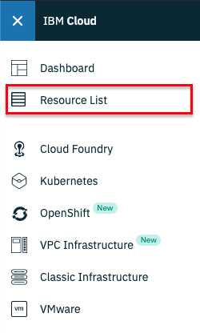
* Na lista de recursos, na seção **Services**, selecione o serviço do Watson Assistant.

  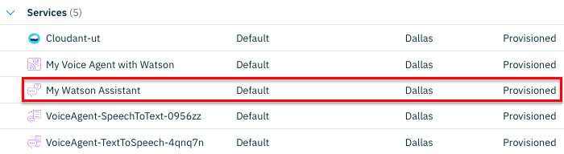
* Acesse a opção de menu **Connections**.
* Clique em **Create connection** para criar uma nova conexão.

  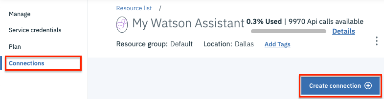
* Na lista de **CLOUD FOUNDRY APPS**, acione o botão **CONNECT** para a sua instância do Node-RED.

  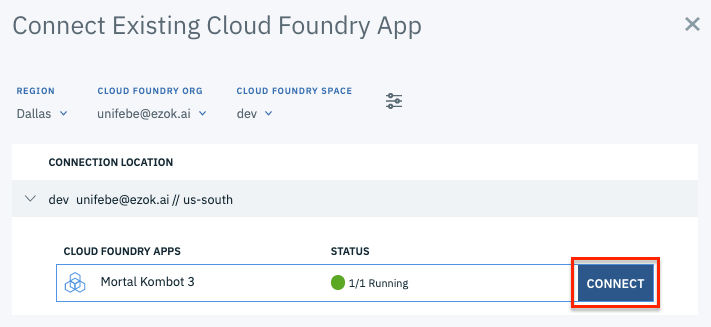
* Na janela que aparecerá, no campo **Access Role for Connection**, selecione a opção **Manager**.
* Clique em **Connect & restage app** para concluir.

  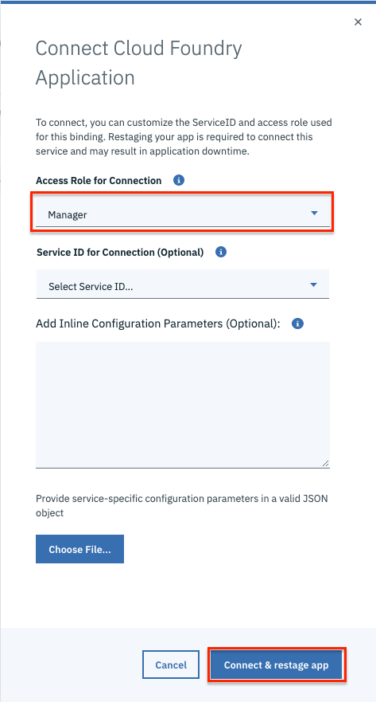
* Confirme a operação clicando em **Restage**.

  

### Obtendo o **Assistant ID**

* Selecione a opção de menu **Manage** e depois cliente em **Launch Watson Assistant** para abrir a plataforma do Watson Assistant.

  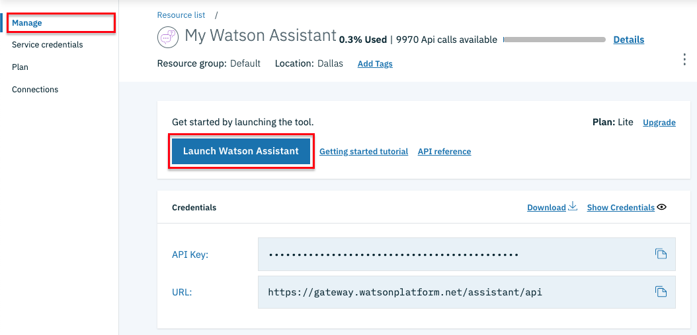
* Acesse a lista de assistentes.

  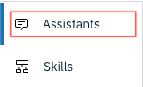
* Escolhe um assistente, abra o menu de opções dele e selecione a opção **Settings**.

  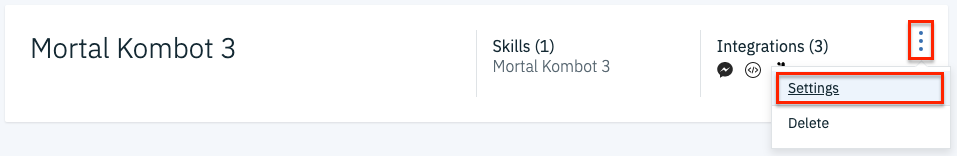
* Na página de configuração do assistente, selecione a opção **API Details**.
* Depois, copie o **Assistant ID**.

  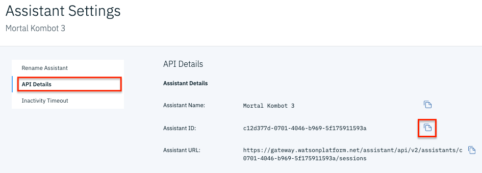

Mantenha todos os valores copiados armazenados em um arquivo de texto.

### Configurando a comunicação com o Watson Assistant

* Feche o Node-RED.
* Acesse o IBM Cloud.
* No canto superior esquerdo, abra o menu de navegação.

  
* Selecione a opção **Resource List**.

  
* Na seção **Cloud Foundry Apps**, selecione a sua instância do Node-RED.

  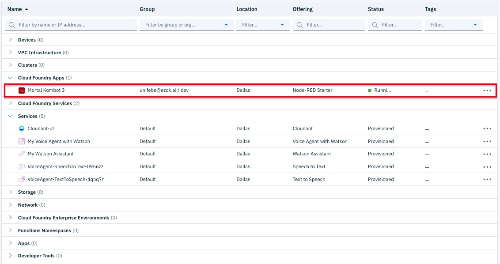
* Clique em **Visit App URL** para abrir a instância do Node-RED.

  
* Clique em **Go to your Node-RED flow editor** para abrir a plataforma Node-RED.

  
* Efetue o *login*.

  
* No painel de nodos, procure por "watson".
* Selecione o arraste o nó **assistant V2** para a área do editor.

  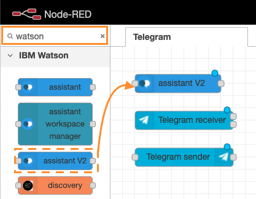
* Dê um duplo clique sobre o nó **assistant V2** para abrir o painel de propriedades.

  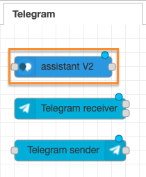
* No campo **Assistant ID**, cole o identificador do assistente que copiamos anteriormente na plataforma Watson Assistant.
* Clique em **Done** para concluir.

  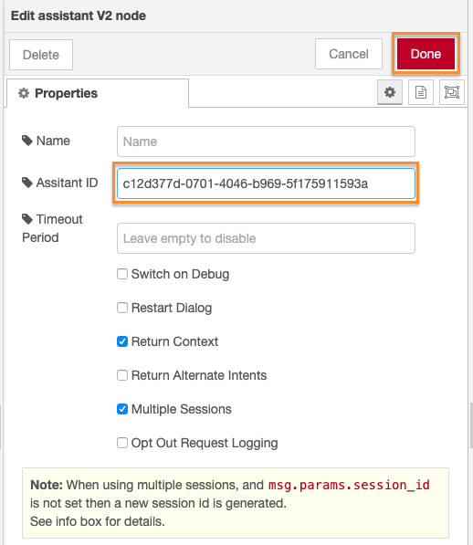


### Encaminhando as mensagens para o Watson

Agora, vamos criar uma função que captura as mensagens enviadas para o nosso *bot* no Telegram e as encaminha para o Watson Assistant.

* Na paleta de nodos, procure por "function".
* Selecione e arraste o nó **function** para o editor.

  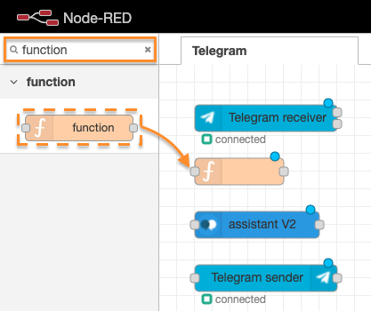
* Dê um duplo clique sobre o nó adicionado para abrir o painel de propriedades.
* No campo **Name** informe "Prepare to Watson Assistant".
* No campo **Function**, insira o código:
  ```javascript
  msg.chatId = msg.payload.chatId;
  msg.payload = msg.payload.content;
  ```
* Clique em **Done** para concluir.

  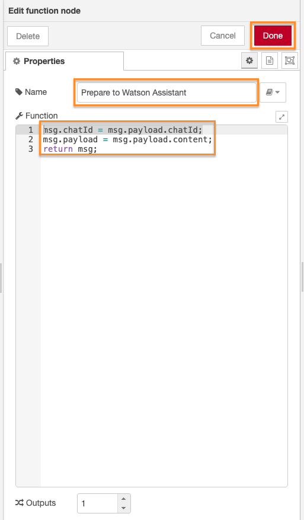

## Retornando as mensagens do Watson para o Telegram

* Na paleta de nodos, procure por "function".
* Selecione e arraste o nó **function** para o editor.

  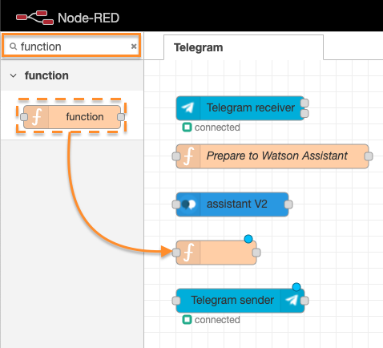
* Dê um duplo clique sobre o nó adicionado para abrir o painel de propriedades.
* No campo **Name** informe "Prepare to Telegram".
* No campo **Function**, insira o código:
  ```javascript
  msg.payload = {
    chatId: msg.chatId,
    type: 'message',
    content: msg.payload.output.generic[0].text
  };
  ```
* Clique em **Done** para concluir.

  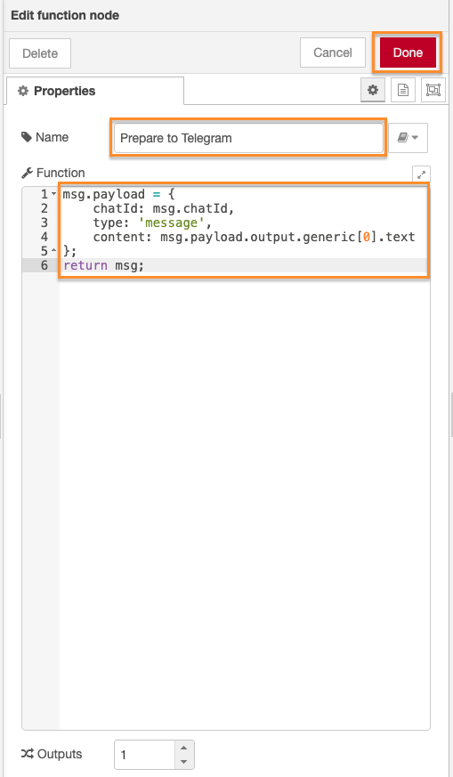

### Finalizando e testando

Para finalizar, ligue os nós da seguinte forma.

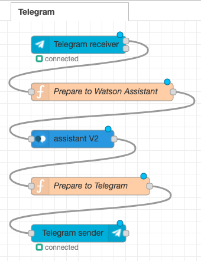

Depois, clique em **Deploy**.


Para testar, abra o Telegram e procure pelo *bot*.

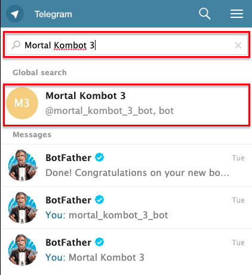

Agora é só iniciar a conversa e testar!

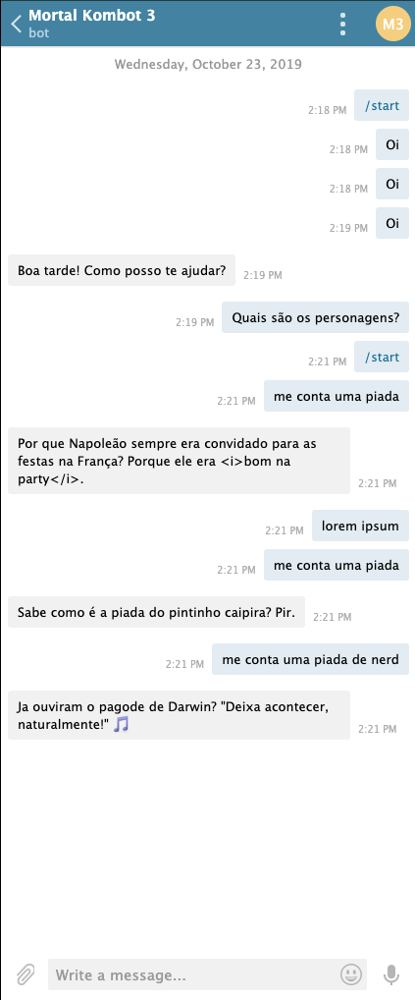

[Voltar](../)