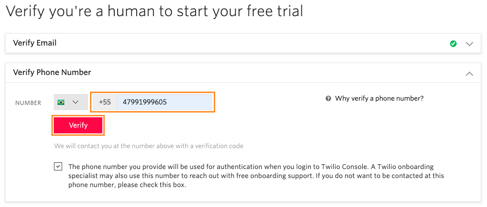
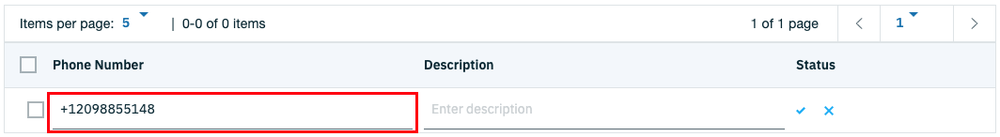
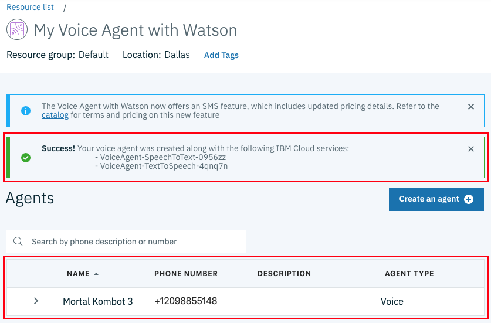

# Voice Agent

O **Voice Agent** é uma tecnologia da IBM que permite realizar comunicação com assistentes construídos com o Watson Assistant através de chamadas telefônicas. Isso mesmo! Nós vamos ligar para um número de telefone e quem irá nos atender será o nosso assistente virtual.

Para fazer essa mágica acontecer, a IBM usa duas API's adicionais:

1. **Speech to Text**: Transforma fala em texto.
2. **Text to Speech**: Transforma texto em fala.

A imagem abaixo foi extraída da [documentação oficial](https://cloud.ibm.com/docs/services/voice-agent?topic=voice-agent-about#watson) da IBM e ilustra como funciona o processo de comunicação.

1. A pessoa que iniciou a ligação faz uma pergunta.
2. A fala é enviada para o serviço **Speech to Text**.
3. A transcrição do texto é retornada.
4. O texto é enviado para o serviço **Watson Assistant** como um mensagem.
5. A resposta para a mensagem é retornada.
6. O texto da resposta é enviado para o serviço **Text to Speech**.
7. O áudio sintetizado é retornado.
8. O **Voice Agent with Watson** envia a resposta para a pessoa.

## Integrando com o Voice Agent

Na plataforma Watson Assistant:

* Acesse a seção **Assistants**

  
* Selecione o assistente desejado

  
* Acione o botão **Add integration**

  
* Selecione a opção **Voice Agent (Telephony)**

  

Você será redirecionado para uma página para realizar o provisionamento do serviço **Voice Agent with Watson**.

* Selecione a região onde o serviço será provisionado

  
* Mantenha o plano **Lite** selecionado

  
* Na parte inferior da página, batize o seu serviço

  
* Para concluir, clique em **Create**, localizado no painel à direita

  

Depois de concluir o provisionamento do serviço **Voice Agente with Watson**, você será redirecionado para uma página com instruções para configuração do serviço.

Para permitir chamadas telefônicas, nós precisamos adiquirir um tronco SIP (*SIP trunk*). Nós podemos adiquirir esse serviço com um dos seguintes provedores:

* [Nexmo](https://dashboard.nexmo.com/sign-up)
* [NetFoundry](https://watson.netfoundry.io/watson-login)
* [Twillio](https://www.twilio.com/try-twilio)
* [VoxImplant](https://voximplant.com/sign-up)

Neste tutorial vamos usar o Twillio.

### Criando um SIP Trunk no Twillio

* Acesse [este](https://www.twilio.com/try-twilio) endereço para criar uma conta no Twillio
* Preencha o formulário de cadastro e clique em **Start your free trial**

  
* Verifica a caixa de entrada do seu e-mail para concluir o processo de criação da conta no Twillio

  
* Informe um número de telefone válido para confirmar a sua conta

  
* Um código de verificação será enviado para o telefone informado. Entre com esse código e clique em **Submit** para avançar

  
* Siga os passos para concluir a criação da conta

Após finalizar a criação da conta, você será direcionado para o painel do Twillio. Clique no botão **Get a Trial Number** para obter um número de testes com $15.50 de crédito.

Agora vamos criar um *SIP Trunk*.

* No menu lateral do Twillio, clique no símbolo **...** para abrir o menu completo

  
* No menu principal, selecione a opção **Elastic SIP Trunking**

  
* Na barra de navegação selecione a opção **Trunks**

  
* Clique no botão **Create new SIP Trunk**

  
* Dê um novo amigável para o seu *SIP Trunk* e clique em **Create**

  
* Uma nova barra de navegação com as opções do novo *SIP Trunk* será exibida. Selecione a opção **Origination**

  
* Clique no botão **Add new Origination URI**

  
* No campo **ORIGINATION SIP URI**, cole a URI disponibilizada no campo **Your agent endpoint**, na página de configuração do **Voice Agent with Watson**

  
  
* Na barra de opções do *SIP Trunk*, selecione a opção **Numbers**

  
* Clique no botão **Add an Existing Number**

  
* Na janela, selecione o número *trial* que criamos anteriormente e clique em **Add Selected** para concluir

  

### Configurando o Voice Agent with Watson

Retornando à página de configuração do Voice Agent with Watson, na terceira seção, intitulada **Create and connect your agent**, clique na opção **Create an agent**.

Você será direcionado para um formulário de configuração do agente de voz.

* **Agent Type**: Selecione a opção **Voice**.
* **Name**: Dê um nome para o seu agente.
* **Phone number(s)**.
  * Clique em **Manage**

    
  * Clique no símbolo **+** para incluir um número

    
  * Informe o número de telefone *trial* fornecido pelo Twillio

    
  * Confirme a inclusão do número

    
  * Selecione o novo número incluído

    
  * Clique em **Done** para concluir

    

Na seção **Conversation**:

* **Service credentials**: Selecione a primeira opção disponível.
* **Skill name**: Selecione a *skill* do seu *chatbot*.

As demais opção serão configuradas automaticamente. Para concluir, clique em **Create an agent**, no topo da página.

Se tudo correr bem, você verá algo semelhante a isto:

Agora vamos fazer algumas configurações adicionais. Primeiro, clique sobre o menu do agente de voz recém criado e selecione a opção **Edit agent**.

Navegue até a seção **Speech to Text**. No campo **Model** selecione um modelo do tipo português brasileiro, para indicar que o idioma reconhecido será o português do Brasil.

Na seção **Text to Speech**, no campo **Voice**, selecione um modelo de voz do tipo **pt-BR**.

Clique em **Save changes** para concluir.

## É hora do show!

Pegue o seu telefone e faça uma ligação para o número de telefone *trial* fornecido pelo Twillio.

[Voltar](../)