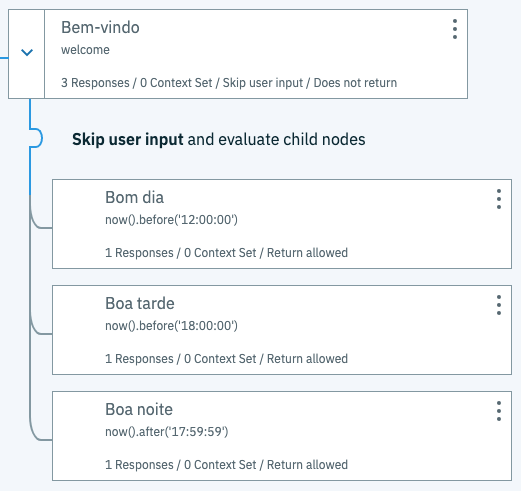
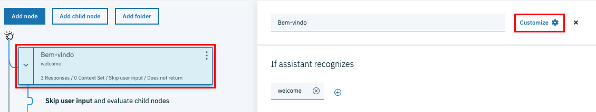
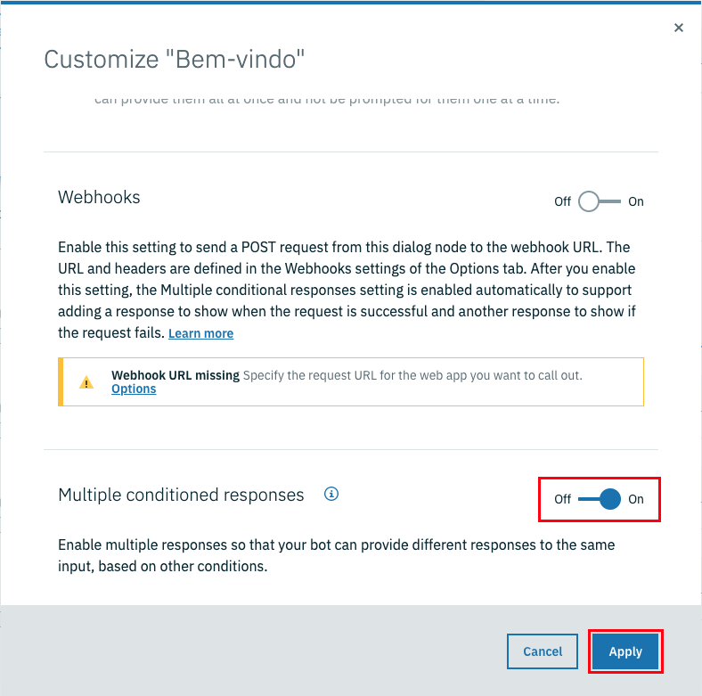
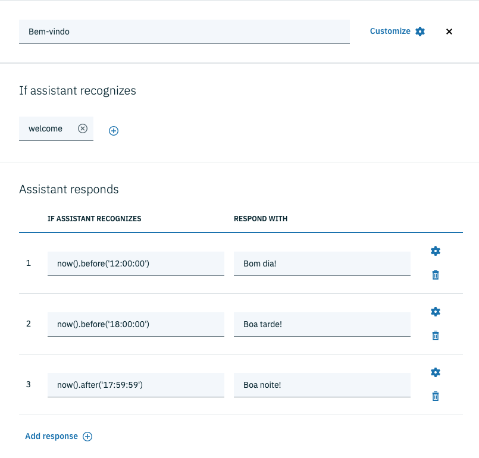

# Respostas múltiplas condicionadas

Este recurso permite que um mesmo nó responda o usuário de diferentes maneiras baseado em condições. A título de exemplo, considere que no nó de boas-vindas desejamos emitir um cumprimento de acordo com a hora do dia:

* Até às 11h59m: Bom dia!
* A partir das 12h e antes das 18h: Boa tarde!
* A partir das 18h: Boa noite!

Naturalmente poderíamos criar algo como apresentado no exemplo a seguir.

O nó denominado `Bom dia` verifica se o horário é inferior à 12h e emite a mensagem "Bom dia!". O nó `Boa tarde` verifica se ho horário é inferior à 18h e emite a mensagem "Boa tarde!". Por fim, o nó `Boa noite` verifica se o horário já ultrapassou 17h59m e exibe a mensagem "Boa noite!".

Observe que nesse exemplo foram utilizadas algumas variáveis e funções para manipulação de data e hora. Para mais informações sobre manipulação de data e hora acesse a documentação [neste](https://cloud.ibm.com/docs/services/assistant?topic=assistant-dialog-methods#dialog-methods-date-time) endereço.

Apesar de funcionar muito bem, essa não é a forma mais elegante de criar respostas múltiplas. Portanto, vamos utilizar um recurso do Watson Assistant criado para esse tipo de situação: **Multiple conditioned responses**.

Para habilitar esse recurso, selecione o nó desejado. À direita do nome do nó clique no botão **Customize**.

Na janela de customização, encontre e habilite a opção **Multiple conditioned responses**. Clique em **Apply** para concluir.

Note que após a opção **Multiple conditioned responses** o nó mudou de aparência. Agora, na seção **Assistant responds**, é possível adicionar diferentes respostas baseadas em condições.

[Voltar](../)