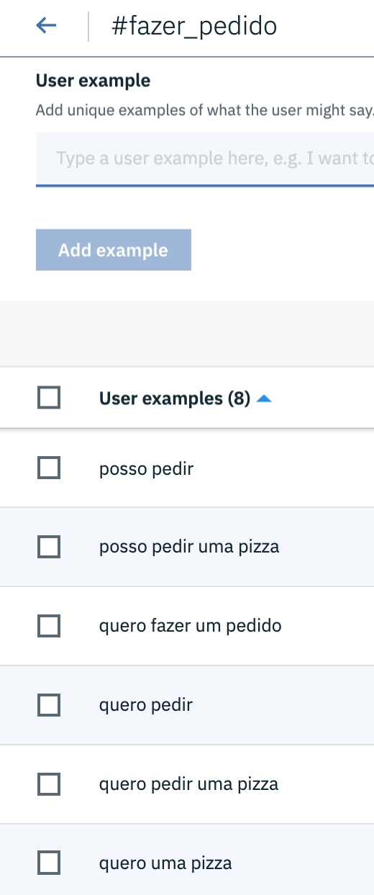
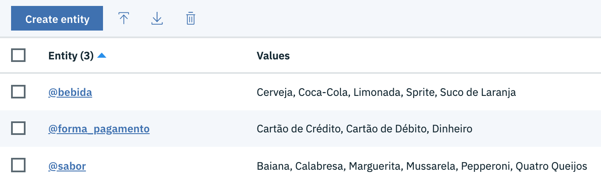
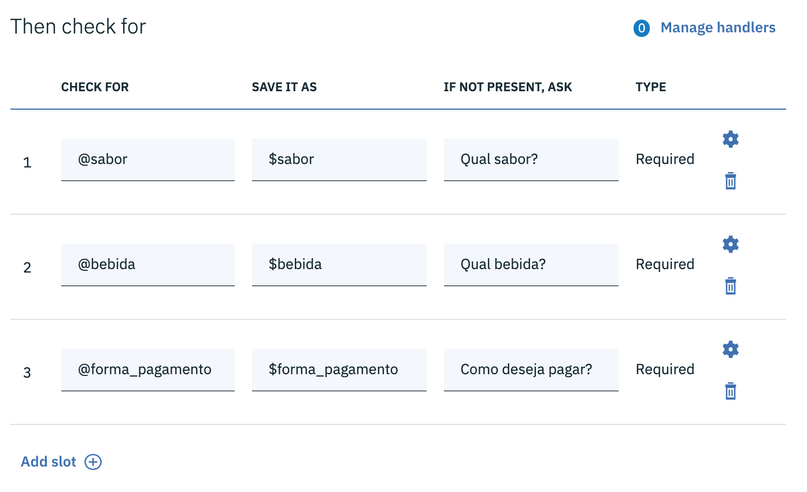
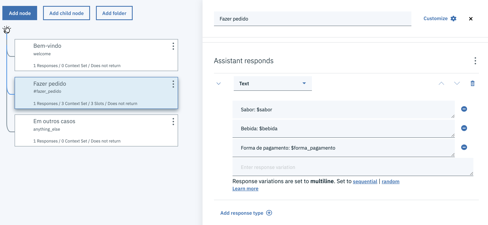

# *Slots*

Os *slots* são usados quando desejamos capturar um conjunto de informações do usuário, sem as quais não é possível avançar para o próximo nó.

Para uma melhor compreensão, considere um assistente de pizzaria para permitir realizar pedidos. Em todos os pedidos o usuário deverá informar:

* O sabor da pizza.
* O que deseja beber.
* A forma de pagamento.

Naturalmente, o usuário poderá realizar o pedido de diferentes maneiras. Eis alguns exemplos:

1. "Gostaria de realizar um pedido"
2. "Quero uma pizza de mussarela"
3. "Quero fazer um pedido. Vocês aceitam cartão de crédito"
4. "Quero pedir uma pizza de calabresa e um suco de laranja. Vou pagar com diheiro"

No primeiro exemplo o usuário não informou sabor, bebida ou forma de pagamento. Portanto, o assistente terá que solicitar todas as informações.

No segundo exemplo o usuário informou o sabor da pizza, mas o assistente ainda precisa perguntar sobre a bebida e a forma de pagamento.

No exemplo número 3, o usuário informa a forma de pagamento, mas não informa sabor e bebida.

No último exemplo o usuário já fornece todos os dados necessário. Portanto, o assistente poderá concluir o pedido.

Para ilustrar o uso de *slots* vamos criar uma nova *Dialog Skill* denominada "Pizzaria". Essa nova *skill* terá apenas uma intenção: `fazer_pedido`.

Também vamos criar três entidades:

1. `sabor`: sabores de pizza
2. `bebida`: bebidas disponíveis
3. `forma_pagamento`: formas de pagamento

Agora vamos criar um nó para processar pedidos de pizza e habilitar esse novo nó para que ele tenha a capacidade de criar *slots*.

Observe que após habilitar os *slots* a caixa de configuração recebeu uma nova seção intitulada *Then check for*. Essa seção é formada por linhas, sendo que cada linha representa um *slot*. Como nosso assistente precisa obter três informações (sabor, bebida e forma de pagamento), vamos criar três linhas.

Cada *slot* é composto por três campos:

* **CHECK FOR**: Expressão que será avaliada.
* **SAVE IT AS**: Nome da variável de contexto que armazenará o dado coletado.
* **IF NOT PRESENT, ASK**: Mensagem que será exibida para o usuário caso a condição definida em **CHECK FOR** não for satisfeita.

No primeiro *slot*, o assistente verifica a existência da entidade `sabor`. Se encontrar, o sabor será armazenado na variável homônima. Caso contrário irá questionar o sabor para o usuário. Enquanto o usuário não informar o sabor ou informar um sabor inexistente o assistente continuará perguntando.

Depois de coletar todas as informações o assistente exibe um resumo do pedido.

Vamos fazer alguns testes.

[Voltar](../)