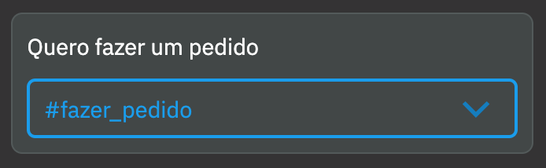
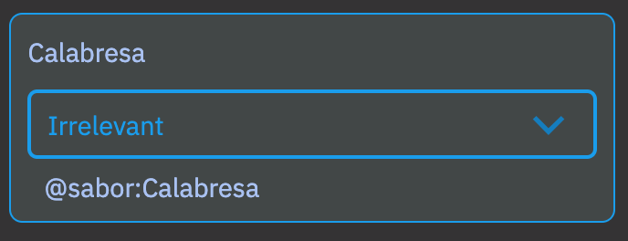
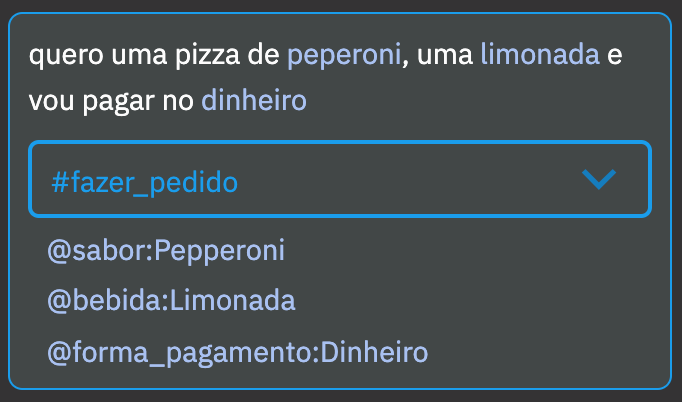
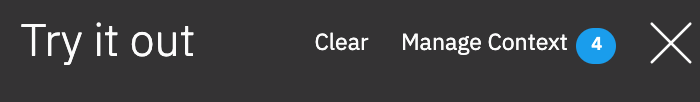
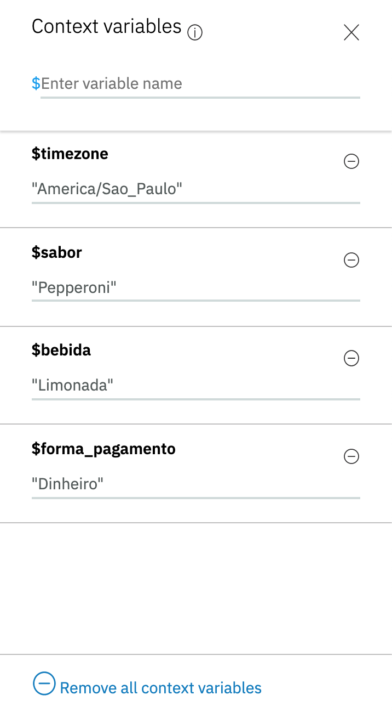

# Área de testes

Você já deve ter percebido que a área de testes, denominada **Try it out**, têm sido de grande ajuda durante o processo de construção de *chatbots*.

Esta seção explica sobre alguns recursos legais da área de testes.

## Pular para o nó processado

Observe que à direita de cada mensagem emitida pelo assistente existe um símbolo. Ao clicar nesse símbolo o Watson Assistant irá selecionar pra você exatamente o nó que foi processado e emitiu aquela mensagem.

## Intenção reconhecida

Sempre que o usuário digita algo, logo abaixo é apresentada a intenção que foi reconhecida naquela expressão.

Se nenhuma intenção foi reconhecida, você verá a palavra *Irrelevant*.

Você pode usar essa área para treinar novas expressões. Ao abrir a caixa de seleção logo abaixo da expressão, você pode selecionar uma intenção. A expressão será automaticamente adicionada à lista de exemplos da intenção selecionada.

## Entidade reconhecida

Logo abaixo da intenção serão exibidas todas as entidades que foram reconhecidas na expressão, bem como o valor capturado.

## Histórico de texto

Na caixa de texto, você pode usar as setas para cima e para baixo do seu teclado para navegar no histórico de textos digitados, poupando precioso tempo!

## Limpar conversa

No topo da área de testes encontramos o botão *Clear*, que nos permite iniciar uma nova conversa.

## Visualizar variáveis de contexto

Também no topo da área de testes está o botão *Manage Context* que, quando acionado, exibe todas as variáveis de contexto que foram criadas.

[Voltar](../)