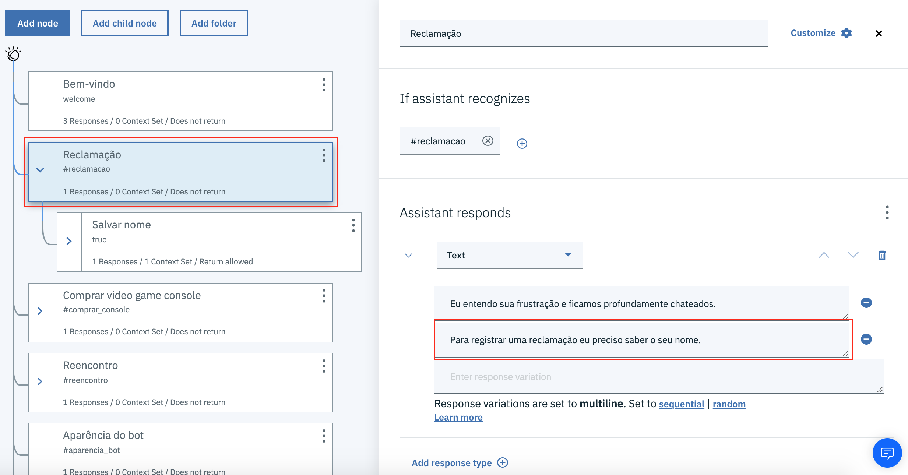
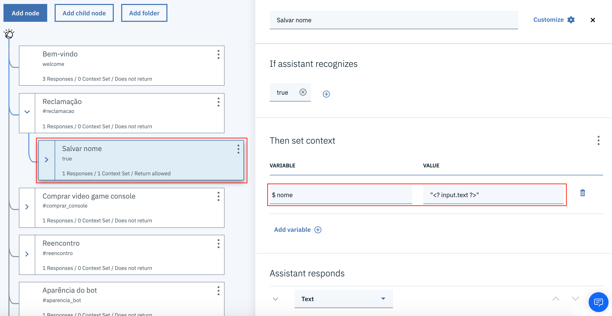
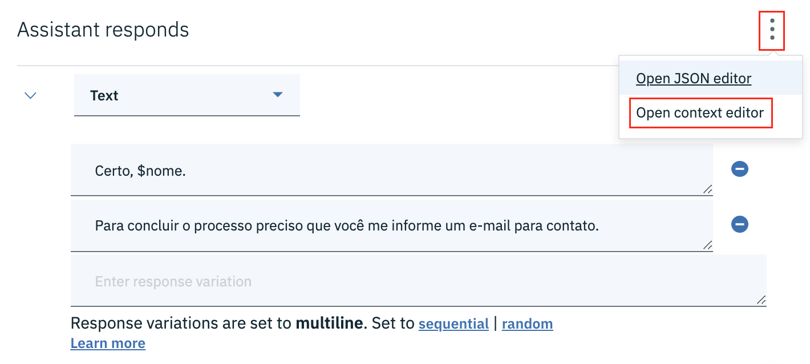
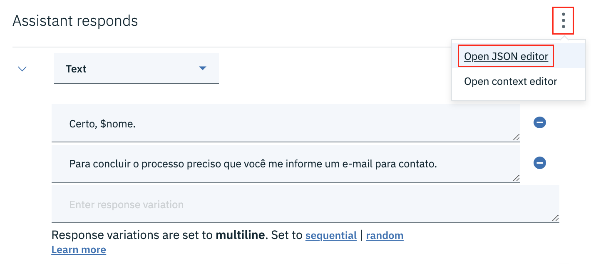
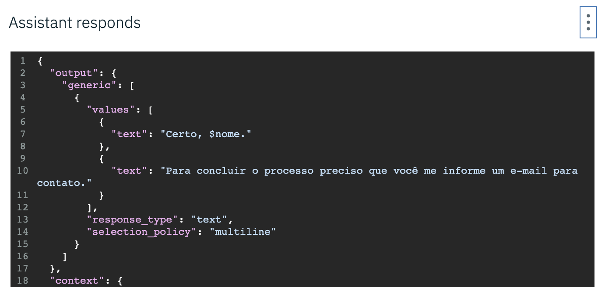

# Variáveis de contexto

Variáveis de contexto são variáveis que ficam armazenadas na memória do assistente durante uma conversa.

Por exemplo, podemos coletar algumas informações do usuário e armazenar em variáveis de contexto.

No exemplo acima, o nó denominado `Reclamação` identifica uma reclamação do usuário e o assistente solicita para o usuário se identificar.

No nó subsequente, o nome do usuário é armazenado numa variável denominada `name`.

Note que no campo **VALUE** o valor da variável faz referência à `input.text`, uma variável especial que armazena a última entrada do usuário. Portanto, estamos salvando o que o usuário digitou e armazenando em uma variável.

Observe também que estamos usando os delimitadores `<?` e `?>`. Esses delimitadores devem ser usados quando desejamos intepretar variáveis e atribuir o seu valor para outra variável de contexto.

Usando esses delimitadores também é possível executar expressões numéricas e outras expressões mais complexas. Para maiores detalhes, leia a documentação oficial do IBM Watson Assistant [neste](https://cloud.ibm.com/docs/services/assistant?topic=assistant-dialog-methods) endereço.

Para criar uma variável de contexto selecione um nó do diálogo. Na caixa de propriedades do nó, à direita do título **Assistant responds**, clique no ícone de menu e selecione a opção **Open context editor**.

Se você está familiarizado com objetos do tipo JSON, você pode editar a variáveis de contexto usando o editor JSON.

Para abrir o editor JSON, clique no ícone de menu à direita do título **Assistant responds** e selecione a opção **Open JSON editor**.

Além de manipular variáveis de contexto, no editor JSON você também pode manipular as respostas do nó.

[voltar](../)