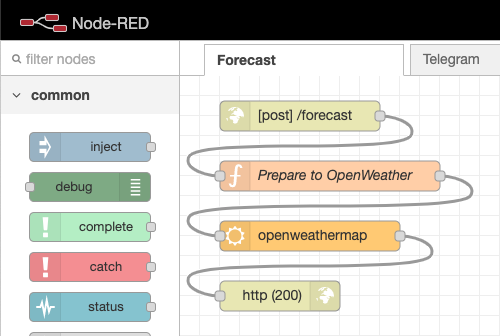
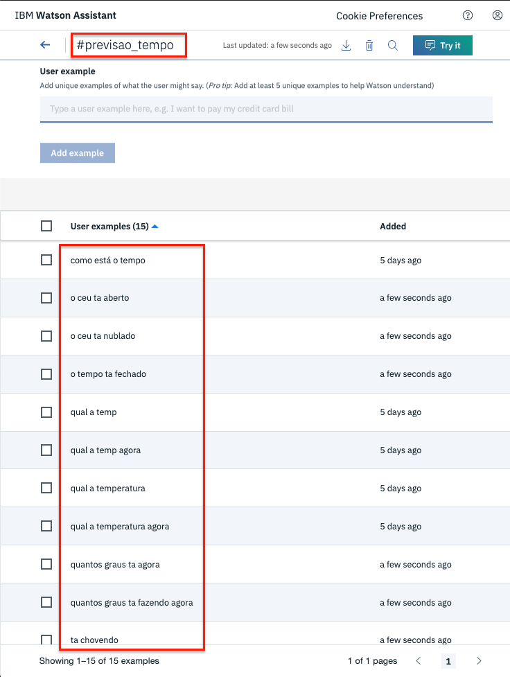

# Webhooks

**Webhooks** são chamadas para API ou URL externas à aplicação com objetivo de consultar uma informação ou executar uma operação.

Para ilustrar o uso de *webhooks*, vamos criar um *chatbot* que mostra o clima atual em uma cidade. Depois que o usuário mostra a intenção de saber sobre o clima, o *chatbot* executará uma chamada à API da [OpenWeather](https://openweathermap.org/) que retornará um objeto JSON com as informações do clima.

## Criando uma conta no OpenWeather

Para usar a API da OpenWeather, precisamos primeiro criar uma conta:

* Acesse [este](https://openweathermap.org) endereço.
* Clique em **Sign Up** para criar uma nova conta.

  
* Preecha o formulário e clique em **Create Account** para prosseguir.

  
* Depois de confirmar a criação da conta, acesse o menu **API keys**.
* Copie e guarde o conteúdo do campo **Key**.

  

## Configurando o Node-RED

Primeiro, crie uma instância do Node-RED na plataforma IBM Cloud. Se você não sabe como criar uma instância do Node-RED, leia a seção **Provisionando o Node-RED** [neste](../integrations/telegram#provisionando-o-node-red) tutorial.

* No Node-RED, clique no símbolo **+** para criar uma nova aba.

  
* Dê um duplo clique sobre a nova aba.

  
* No painel de propriedades da aba, preencha o campo **Name**.
* Clique em **Done** para salvar.

  
* Abra o menu de navegação e selecione **Manage palette**.

  

* Abra a seção **Install**.
* No campo de busca procure por "openweathermap".
* Instale o pacote **node-red-node-openweathermap**.

  

* Depois de instalar o pacote, na paleta de componentes procure por "http".
* Arraste para o editor o nó denominado **http in**.

  
* Dê um duplo clique sobre o nó para abrir a sua caixa de propriedades.
* No campo **Method**, selecione a opção **POST**.
* No campo **Name**, informe `/forecast`.
* Clique em **Done** para concluir.

  
* No palete de nodos, procure pelo nó chamado "function"

  
* Dê um duplo clique sobre o nó para abrir a sua caixa de propriedades.
* No campo **Name**, informe `Prepare to OpenWeather`.
* No campo **Function**, informe o seguinte código fonte:
  ```javascript
  msg.location = {
    city: msg.payload.city,
    country: msg.payload.country
  };
  ```
* Clique em **Done** para concluir.

  
* Novamente na paleta de nodos, procure pelo nó "openweathermap".
* Selecione e arraste para o editor o nó denominado **openweathermap**.

  
* Dê um duplo clique sobre o nó para abrir a sua caixa de propriedades.
* No campo **API Key** informe a chave da API fornecida pelo OpenWeather.
* No campo **Language** selecione a opção **Portuguese**.
* Abaixo, selecione a opção **Current weather for**.
* No campo **Location**, mantenha selecionada a opção **City, Country**.
* Clique em **Done** para concluir.

  
* Novamente na paleta de nodos, procure por "http".
* Selecione e arraste para o editor o nó **http response**.

  
* Dê um duplo clique sobre o nó para abrir sua janela de propriedades.
* Preencha o campo **Status code** com o valor `20`.
* Clique em **Done** para salvar.

  
* Ligue todos os nodos conforme a imagem a seguir.

  
* Para finalizar, clique em **Deploy** para salvar as alterações.

  

## Obtendo o endereço da API Node-RED

Na seção anterior, nó criamos um *endpoint* para uma API HTTP que recebe como parâmetro a sigla de um país e o nome de uma cidade, e retorna as informações atuais do clima cidade.

Agora, precisamos descobrir qual o endereço para acessar essa API. Primeiro, através do painel da IBM Cloud, pelo serviço Node-RED.

* Na IBM Cloud, abra o menu de navegação.

  
* Selecione a opções **Resource list**.

  
* Abra a seção **Cloud Foundry Apps**.
* Selecione a sua instância do Node-RED.

  
* Clique em **Routes** e copie o endereço que aparece no diálogo.

  

## Criando o *bot*

Vamos criar um novo *dialog skill* na plataforma IBM Watson Assistant e batizá-lo de **Forecast**. Essa nova *skill* será composta por apenas uma intenção e uma entidade.

A intenção será denominada `previsao_tempo` e conterá frases que indicam o desejo do usuário em saber o clima atual numa determinada cidade.



A entidade será denominada `cidade` e conterá algumas cidades da nossa região.


No diálogo, além dos nodos padrão, criaremos um nó denominado `Previsão do tempo`. Esse nó usará [*slots*](../slots) para verificar se o usuário informou uma cidade. Se uma cidade não for informada, ele irá questionar o usuário para informar uma cidade.


Agora vamos configurar o *webhook* para consultar o clima:

* Selecione a opção **Options** e depois **Webhooks**.

  
* No campo **URL** informe o endereço da sua aplicação que obtido na etapa anterior e acrescente `/forecast` no final.

  
* Retorne para a seção **Dialog**

  
* Selecione o nó `Previsão do tempo` e acione o botão **Add child node** para adicionar um nó filho.

  
* Vamos batizar o novo nó como `Consultar clima`.
* Na seção **If assistant recognizes** entre com a condição `true`.

  
* Depois, clique em **Customize**.
* Na janela de customização, habilite os *webhooks*.
* Clique em **Apply** para salvar.

  
  
* O nó receberá uma nova seção denominada **Then callout to my webhook**. Nessa seção crie os seguintes parâmetros:
  * **`city`**: `<? $cidade ?>`
  * **`country`**: `br`
* No campo **Return variable** informe o valor `$result`.

  
* Na seção **Assistant responds**, na primeira linha, clique na engrenagem para visualizar os detalhes.

  
* Agora, vamos configurar a resposta com seis linhas:
  * `$result.detail.`
  * `Temperatura: $result.tempc graus.`
  * `Temperatura mínima: $result.temp_minc graus.`
  * `Temperatura máxima: $result.temp_maxc graus.`
  * `Humidade relativa do ar: $result.humidity %.`
  * `Velocidade do vento: $result.windspeed km/h`
* Marque a opção **multiline** para variação de respostas.
* Clique em **Save** para salvar.

  
* No nó `Previsão do tempo`, na seção **Then assistant should**, selecione a opção **Skip user input**.

  

Agora vamos testar!


## Material

* [Dialog Skill](skill-Forecast.json)
* [Node-RED flow](flows.json)